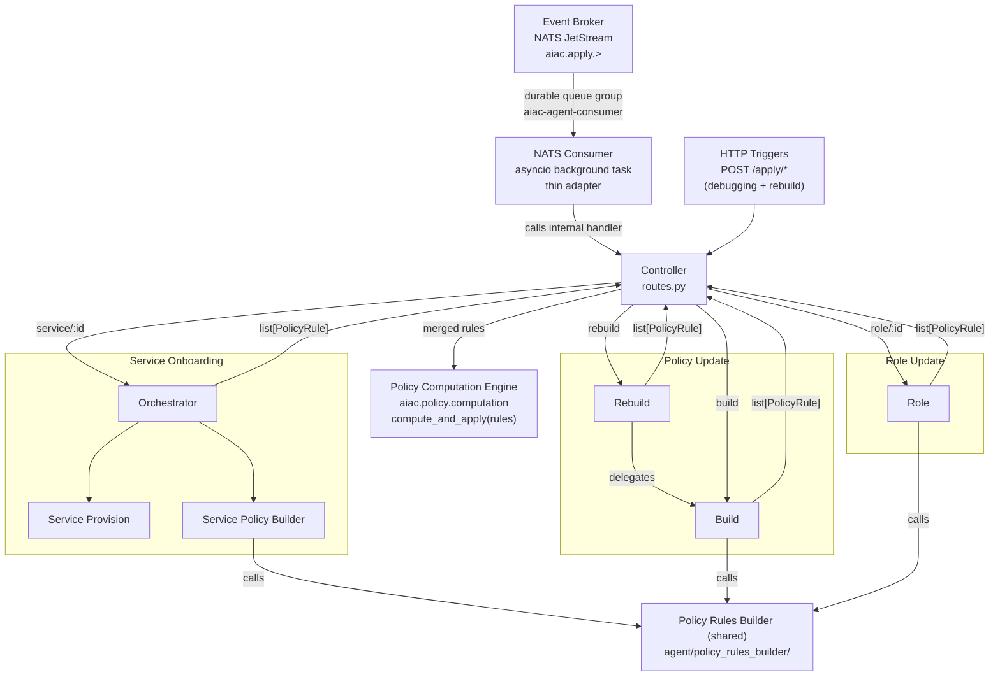

# Component PRD: AIAC Agent

## Description

A LangGraph-based AI agent service that enforces a natural-language access control policy against the live PDP state. Triggered via the **Event Broker** (NATS JetStream) for all automated triggers, and directly via HTTP for the operator-only `rebuild` command:

- **Event Broker** → `aiac.apply.service.{id}` subject (originated by Keycloak SPI `CLIENT_CREATED`)
- **Event Broker** → `aiac.apply.role.{id}` subject (originated by Keycloak SPI role created/updated)
- **Event Broker** → `aiac.apply.policy.build` subject (originated by RAG Ingest Service post-ingest)
- **Operator/admin call** → `POST /apply/policy/rebuild` directly via `kubectl port-forward` (HTTP only — not routed through Event Broker)

The Agent subscribes to the Event Broker as a durable competing consumer (`aiac-agent-consumer` queue group). It acknowledges each message only after successful processing — ensuring at-least-once delivery and automatic replay on pod restart.

The `/apply/*` HTTP endpoints are retained as a debugging escape hatch. The **NATS consumer is a thin adapter layer** that receives events from the Event Broker and calls the same internal `/apply/*` handler functions — there is no duplicated business logic.

The service is structured as a **Controller** (FastAPI routes) that dispatches to the **Service Onboarding Orchestrator** (UC1) or directly to the Policy Update and Role Update sub-agents (UC2, UC3). Each producing sub-agent calls the **shared Policy Rules Builder** (`agent/policy_rules_builder/`) directly, merges the results internally, and returns a single `list[PolicyRule]` to the Controller. The Controller calls `compute_and_apply(merged_rules)` from `aiac.policy.computation` (PCE) once.

| Use Case | Dispatch | Sub-agents | Sub-agent output |
|---|---|---|---|
| Service Onboarding (UC1) | via Orchestrator | Service Provision + Service Policy Builder | `list[PolicyRule]` |
| Policy Update (UC2) | Controller → sub-agent directly | Build or Rebuild (TBD) | `list[PolicyRule]` |
| Role Update (UC3) | Controller → sub-agent directly | Role sub-agent | `list[PolicyRule]` |

Each producing sub-agent calls the **shared Policy Rules Builder** (`agent/policy_rules_builder/`) for each applicable (roles, scope) or (role, scopes) pair, merges the results, and returns a single `list[PolicyRule]` to the Controller. The Controller calls `compute_and_apply(merged_rules)` from `aiac.policy.computation` (PCE) once — no shared apply node exists. The PCE owns all Policy Store ↔ PDP Policy Writer coordination. Neither sub-agents nor the Policy Rules Builder call `aiac.pdp.policy.library` or `aiac.policy.store.library` directly.

All components are **logically separated modules within a single pod and process** — no inter-service network calls between orchestrators and sub-agents.



---

## NATS Consumer

A thin adapter started as an **asyncio background task** in the FastAPI `lifespan` handler. It subscribes to the `aiac.apply.>` wildcard on the `aiac-events` NATS JetStream stream using the `aiac-agent-consumer` durable queue group.

### Dispatch table

| Subject pattern | Internal handler |
|---|---|
| `aiac.apply.service.{id}` | Service Onboarding Orchestrator (UC1) |
| `aiac.apply.role.{id}` | Role Update sub-agent (UC3, via Controller) |
| `aiac.apply.policy.build` | Policy Update Build sub-agent (UC2, via Controller) |

### Ack contract

The consumer **awaits** the internal handler before issuing the NATS acknowledgement. On handler success → ack. On handler exception → do not ack; NATS redelivers after `AckWait`. After 5 unacknowledged redeliveries, NATS routes the message to `aiac.apply.dlq`.

Fire-and-forget (`asyncio.create_task`) is explicitly prohibited — acking before handler completion would break at-least-once guarantees.

### Failure isolation

The consumer and the FastAPI HTTP server share the same process. If the Agent pod crashes mid-processing, the in-flight message was never acked and NATS redelivers it to the next pod instance. This prevents the consumer from exhausting retry counts against an unavailable handler (which would occur if they were separate containers).

### Configuration

| Variable | Default | Source |
|---|---|---|
| `NATS_URL` | `nats://aiac-event-broker-service:4222` | ConfigMap (`aiac-pdp-config`) |

---

## Controller

The Controller is a FastAPI routes layer (`controller/routes.py`). Its responsibilities are:

- Parse the trigger type and entity ID from the request path.
- Dispatch to the Service Onboarding Orchestrator (UC1) or directly to the Policy Update / Role Update sub-agents (UC2, UC3).
- Receive the `list[PolicyRule]` returned by the Orchestrator or sub-agent (already merged by the sub-agent).
- Call `compute_and_apply(merged_rules)` from `aiac.policy.computation` (PCE) once.
- Return a bare HTTP status code to the caller; write summary and debug info to the log.

No per-use-case business logic, retry handling, or state assembly lives in the Controller. PRB calls are owned by the producing sub-agents; the Controller's shared step is the single PCE call.

---

## Use Cases

Each use case (and the UC1 Orchestrator) is specified in a dedicated sub-PRD:

| Use Case | Sub-PRD | Trigger(s) | Notes |
|---|---|---|---|
| Service Onboarding | [aiac-agent/uc1-service-onboarding.md](aiac-agent/uc1-service-onboarding.md) | `aiac.apply.service.{id}`, `POST /apply/service/{id}` | Orchestrator sequences: Service Provision → Service Policy Builder (IdP reader + PRB invoker) |
| Policy Update | [aiac-agent/uc2-policy-update.md](aiac-agent/uc2-policy-update.md) | `aiac.apply.policy.build`, `POST /apply/policy/build`, `POST /apply/policy/rebuild` | |
| Role Update | [aiac-agent/uc3-role-update.md](aiac-agent/uc3-role-update.md) | `aiac.apply.role.{id}`, `POST /apply/role/{id}` | |

> **Note:** Each producing sub-agent calls the **shared Policy Rules Builder** directly, merges the results, and returns `list[PolicyRule]` to the Controller. The Controller calls `compute_and_apply(merged_rules)` from `aiac.policy.computation` (PCE) once. Policy rule application is fully specified in [policy-computation-engine.md](policy-computation-engine.md). The Policy Rules Builder is specified in [aiac-agent/policy-rules-builder.md](aiac-agent/policy-rules-builder.md).

### IdP access — library, not service

Every sub-agent (UC1 Provision + Service Policy Builder, UC2 Build + Rebuild, UC3 Role) performs **all** IdP reads and writes through the **idp-library** API — `aiac.idp.configuration.api.Configuration` — and **never** calls the IdP Configuration **service** (`aiac.idp.service.configuration.*`) or its HTTP endpoints directly. The library owns the HTTP transport, retry/backoff, and Keycloak↔model mapping; sub-agents depend only on its typed `Configuration` methods (e.g. `get_service`, `get_roles`, `get_scopes`, `create_service_role`, `create_service_scope`, `set_service_type`). The shared service-type vocabulary is `aiac.idp.configuration.models.ServiceType` (`Agent`/`Tool`) — the same enum used by `Service.type`. See [library-idp.md](library-idp.md).

---

## Endpoints

| Method | Path | Orchestrator | Sub-agent |
|---|---|---|---|
| POST | `/apply/policy/build` | Policy Update | Build |
| POST | `/apply/policy/rebuild` | Policy Update | Rebuild |
| POST | `/apply/role/{role_id}` | Role Update | Role |
| POST | `/apply/service/{service_id}` | Service Onboarding | Provision |

All endpoints return bare HTTP status codes: `200 OK` on success (no response body), and the status codes from the Error Handling table on upstream failure. Success responses carry no body; upstream failures are raised as FastAPI `HTTPException`s, so error responses carry FastAPI's default JSON error body (`{"detail": ...}`) alongside the status code. Summary, applied-rule details, and debug information are written to the service log. Validation failures surface as an error status and log entry; detailed reporting is specified in [policy-rules-builder.md](aiac-agent/policy-rules-builder.md).

---

## Configuration

| Variable | Default | Source |
|---|---|---|
| `NATS_URL` | `nats://aiac-event-broker-service:4222` | ConfigMap (`aiac-pdp-config`) |
| `AIAC_PDP_CONFIG_URL` | `http://aiac-pdp-config-service:7071` | ConfigMap (`aiac-pdp-config`) — used by `aiac.idp.configuration.api` (in-process via PCE) |
| `AIAC_PDP_POLICY_URL` | `http://aiac-pdp-policy-service:7072` | ConfigMap (`aiac-pdp-config`) — used by `aiac.pdp.policy.library` (in-process via PCE) |
| `AIAC_POLICY_STORE_URL` | `http://aiac-policy-store-service:7074` | ConfigMap (`aiac-pdp-config`) — used by `aiac.policy.store.library` (in-process via PCE) |
| `AIAC_CHROMADB_URL` | `http://aiac-rag-service:8000` | ConfigMap (`aiac-pdp-config`) |
| `KEYCLOAK_REALM` | — | ConfigMap (`aiac-pdp-config`) |
| `LLM_BASE_URL` | — | ConfigMap |
| `LLM_MODEL` | — | ConfigMap |
| `LLM_API_KEY` | — | Kubernetes Secret |
| `AIAC_AC_MODEL` | `RBAC` | ConfigMap (accepted: `RBAC`, `ABAC`, `REBAC`) |
| `CHROMA_N_RESULTS` | `10` | ConfigMap |
| `MAX_CHANGES_PER_RUN` | `50` | ConfigMap |
| `UPSTREAM_MAX_RETRIES` | `3` | ConfigMap |

ChromaDB collections: `aiac-policies` and `aiac-domain-knowledge`.

---

## Error Handling

All upstream calls are retried up to `UPSTREAM_MAX_RETRIES` times with exponential backoff (`tenacity`) before propagating the error. The retry primitive is the project-level shared `run_upstream(fn)` helper (`aiac/shared/upstream.py`), which is transport-agnostic: it re-raises the original exception after the final attempt. Retry is applied at the **transport boundary**, not at the agent call sites — inside the idp-library `Configuration` (its `_request` helper), inside the provision MCP helper (`_mcp_tools_list`), and inside the provision Kubernetes seam (`uc/onboarding/provision/kube.py`). Each caller then maps the re-raised failure to the status below (e.g. an IdP/Kubernetes failure → `502`).

| Upstream | HTTP status on final failure |
|---|---|
| ChromaDB | `503 Service Unavailable` |
| IdP Configuration Service | `502 Bad Gateway` |
| PDP Policy Writer | `502 Bad Gateway` |
| Kubernetes API | `502 Bad Gateway` |
| LLM API | `504 Gateway Timeout` |

Upstream failures propagate as bare HTTP error responses (see table above), raised as FastAPI `HTTPException`s; the status code is authoritative and error responses carry FastAPI's default JSON error body (`{"detail": ...}`). All failure details are logged.

---

## Runtime

- Framework: FastAPI with uvicorn
- Bind: `0.0.0.0:7070`
- State: stateless — changes applied immediately, no pending session required
- Base image: `python:3.12-slim`

---

## File Structure

```
aiac/src/aiac/
├── shared/                             ← project-level shared: run_upstream (upstream.py) — transport retry primitive
└── agent/
    ├── controller/
    ├── shared/                         ← flatten_role (roles.py)
    ├── uc/
    │   ├── onboarding/
    │   │   ├── orchestrator.py         ← sequences provision → policy_builder, returns list[PolicyRule]
    │   │   ├── provision/              ← LLM sub-agent: classify, analyze, write to IdP; kube.py = retrying K8s seam
    │   │   └── policy_builder/         ← IdP reader + PRB invoker: read IdP, call PRB, return list[PolicyRule]
    │   ├── policy_update/
    │   │   ├── build/                  ← calls PRB, returns list[PolicyRule]; TBD internals
    │   │   └── rebuild/                ← delegates to Build; TBD internals
    │   └── role_update/                ← calls PRB with (role, all_scopes), returns list[PolicyRule]
    └── policy_rules_builder/           ← shared; called by Service Policy Builder, Build, and Role sub-agent
```

Docker build command (run from repo root):

```bash
docker build -f aiac/src/aiac/agent/controller/Dockerfile \
             -t aiac-agent:latest \
             aiac/src/
```

---

## Dependencies (`requirements.txt`)

```
langgraph
langchain-openai
chromadb
tenacity
fastapi
uvicorn[standard]
requests
python-dotenv
kubernetes
nats-py
```
