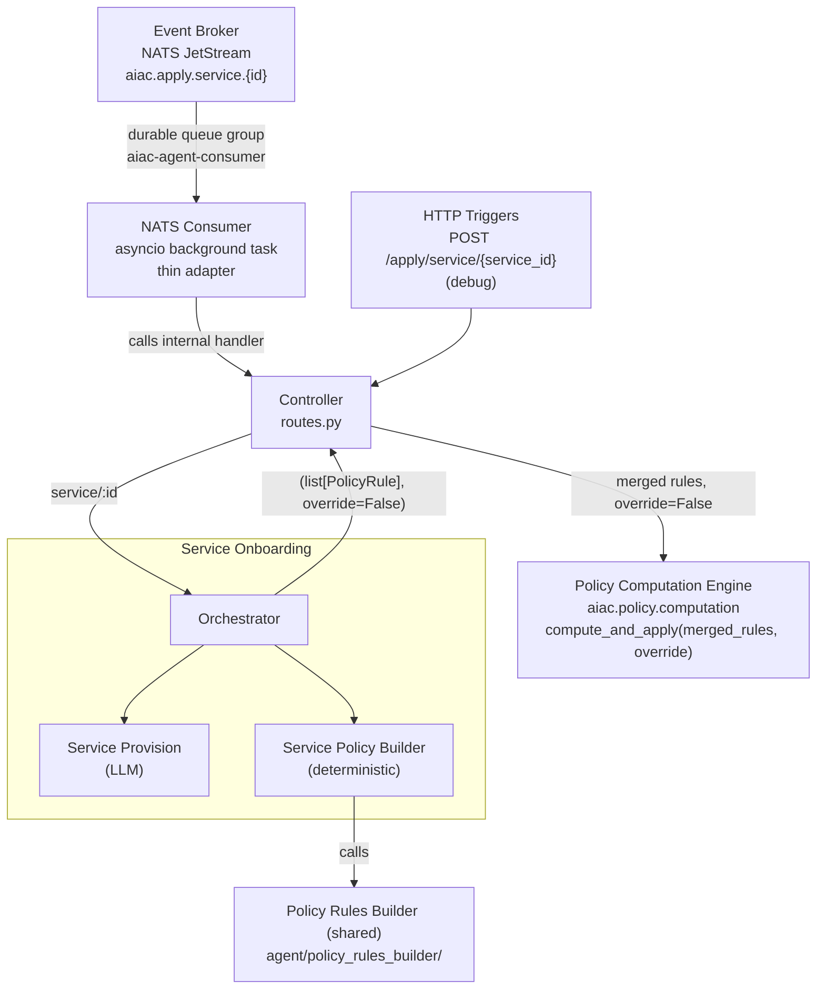

# Component Sub-PRD: UC1 — Service Onboarding

> **Depends on:** [`../aiac-agent.md`](../aiac-agent.md) — NATS Consumer, Controller, Shared Module, Configuration, Error Handling, Runtime.

> **IdP access — library, not service.** All IdP reads and writes go through the **idp-library** API (`aiac.idp.configuration.api.Configuration`), **never** the IdP Configuration **service** (`aiac.idp.service.configuration.*`) or its HTTP endpoints directly. See [aiac-agent.md → IdP access](../aiac-agent.md#idp-access--library-not-service).

## Triggers

| Source | Subject / Path |
|---|---|
| Event Broker (NATS) | `aiac.apply.service.{id}` (originated by Keycloak SPI `CLIENT_CREATED`) |
| HTTP (debug) | `POST /apply/service/{service_id}` |

## Architecture overview

UC1 is the only use case with an Orchestrator, because it is a two-stage pipeline:

1. **Service Provision** (LLM-based): classify the new service, derive its roles + scopes, write them into the IdP.
2. **Service Policy Builder** (deterministic): read the full IdP role + scope universe (excluding the new service's own entities), call the PRB for each applicable pair, and return a merged `list[PolicyRule]` to the Orchestrator.

The Orchestrator returns `(list[PolicyRule], override=False)` to the Controller. The Controller calls the PCE with that `override` flag; the PCE owns all rule reconciliation. UC1 is **incremental** — existing roles receive a partial new mapping and must not lose their other access — so the mode is always append (`override=False`).



## Orchestrator

`onboarding/orchestrator.py`

**Sequence:**
1. Call `ServiceProvisionGraph.invoke()` → get back `ServiceProvision { roles, scopes }` + `service_type`.
2. Call `ServicePolicyBuilder.build(service_id, service_type)` → get back `list[PolicyRule]`. Service Policy Builder re-reads the service's own roles/scopes from the IdP by `service_id` (Provision has already persisted them), so it needs only the id, not the `ServiceProvision`.
3. Return `(list[PolicyRule], override=False)` to the Controller.

No LLM calls, retry logic, or response assembly in the Orchestrator beyond sequencing.

**Replay safety (at-least-once delivery):** Service Provision IdP writes are **idempotent** (create-or-get by name: `create_service_role` / `create_service_scope` return the existing entity on a duplicate call). The PCE reconcile is also idempotent. If the pod crashes between Service Provision completing and the PCE call, NATS redelivers and the full pipeline re-runs safely to convergence. There is **no rollback logic**.

---

## Sub-agent: Service Provision

`onboarding/provision/`

**Nature:** LLM-based. Classifies the new service (agent or tool), derives roles + scopes from AgentCard / MCP manifest, and **writes them into the IdP**.

All IdP writes and reads target the **idp-library** — `aiac.idp.configuration.api.Configuration` — not the IdP service directly:
- `create_service_role(service_id, role)` — idempotent (create-or-get by name, then map)
- `create_service_scope(service_id, scope)` — idempotent (create-or-get by name, then map)

### Graph

```
START → classify_service → [analyze_agent | analyze_tool] → provision_service → END
```

### Nodes

- **`classify_service`**: resolves identity + determines service type from the operator's authoritative `kagenti.io/type` label (values `agent`/`tool`) — **not** from the `entity_id` format.
  1. Store `service_id = trigger.entity_id` (Keycloak `client_id`).
  2. Resolve identity: call `get_service(service_id)` from `aiac.idp.configuration.api` → `client.name`, which the kagenti-operator sets to `"{namespace}/{workload_name}"` for every workload (agents and tools, SPIRE-enabled or not). Split on the first `/` → store `namespace` and `workload_name`. `502` if `client.name` has no `/` (namespace unrecoverable).
  3. LIST pods in `namespace`; select the pod owned by `workload_name` via `ownerReferences` (Deployment → ReplicaSet name prefix, or `StatefulSet`/`Sandbox` name match). `502` on Kubernetes API failure or no matching pod.
  4. Read the `kagenti.io/type` label on that pod and normalize it to a `ServiceType`
     member via `ServiceType(label.capitalize())` — the label is lowercase
     (`agent`/`tool`); `ServiceType` values are capitalized (`Agent`/`Tool`):
     - `agent` → `ServiceType.AGENT`; route to `analyze_agent`.
     - `tool` → `ServiceType.TOOL`; route to `analyze_tool`.
     - Absent or any other value (normalization raises `ValueError`) → `502` (inconsistent deployment).

  > K8s access: `list` on `pods` in the target namespace (both paths).
  > `kagenti.io/type` is authoritative — applied by the kagenti-operator (via the AgentRuntime CR) and propagated to pod labels; it is the operator's own agent/tool discriminator (`SkipReason`, kagenti-operator `internal/clientreg/names.go`). The operator only registers a Keycloak client for a workload that already carries this label, so it is effectively guaranteed for operator-registered clients; a missing/invalid value still fails loud (`502`, naming the workload + label). The `entity_id` format (SPIFFE vs plain) reflects whether SPIRE is enabled, **not** the service type, so it is not used for classification.

- **`analyze_agent`**: non-LLM node; reads AgentCard CR.
  1. LIST `AgentCard` CRs (`agent.kagenti.dev/v1alpha1`) in `namespace`; find the one matching `workload_name`.
  2. **AgentCard found** → produce `ServiceProvision`:
     - `roles`: `[RoleDefinition(name=f"{workloadName}.agent", description="Agent role")]`
     - `scopes`: `[ScopeDefinition(name=f"{workloadName}.{skill.name}", description=skill.description) for skill in card.skills]`
     - `reasoning`: `f"derived from AgentCard: {len(skills)} skills"`
  3. **AgentCard not found** (legacy deployment) → produce minimal `ServiceProvision`:
     - `roles`: `[RoleDefinition(name=f"{workloadName}.agent", description="Agent role")]`
     - `scopes`: `[ScopeDefinition(name=f"{workloadName}.access", description="Default access scope")]`
     - `reasoning`: `"partial: no AgentCard found, default scope assigned"`

  > K8s access: `list` on `agentcards.agent.kagenti.dev` in the target namespace.

- **`analyze_tool`**: non-LLM node; discovers MCP tools. `namespace` + `workload_name` are already resolved by `classify_service` (from the `client.name` split). MCP endpoint lookup uses the **hybrid Keycloak→K8s strategy** decided in issue [`6.2`](../../issues/agent/service-onboarding/6.2-analyze-tool-lookup-strategy.md): the Keycloak client name supplied the key `{namespace, workload_name}`; K8s supplies the reachable endpoint.
  1. Locate MCP endpoint:
     a. GET the K8s `Service` named `workload_name` in `namespace` (operator convention: Service name == workload name).
     b. Require the `protocol.kagenti.io/mcp` label present on that Service; `502` (actionable) if absent — the label is applied at deploy time, not stamped by the operator.
     c. Build `http://{workload_name}.{namespace}.svc.cluster.local:{port}/mcp`, where `port` is the Service's first port (not hardcoded).
  2. Call `tools/list` (HTTP POST, MCP protocol) on the resolved endpoint.
  3. Produce `ServiceProvision`:
     - `roles`: `[]` (tools do not initiate further calls)
     - `scopes`: `[ScopeDefinition(name=f"{workload_name}.{tool.name}", description=tool.description) for tool in manifest.tools]`
     - `reasoning`: `f"derived from MCP manifest: {len(tools)} tools"`
  4. Returns `502` on Service/label lookup failure or MCP call failure.

  > K8s access: `get` on `services` in the workload namespace (tool path). Identity is resolved by `classify_service` (config API).
  > MCP path convention: all MCP tool services must serve at `/mcp` and carry the `protocol.kagenti.io/mcp` label. This label is a **deploy-time prerequisite** — the kagenti-operator does not stamp it today; automatic stamping is requested upstream (`docs/gh-issues/kagenti-operator-mcp-label-stamping.md`). Until then it must be applied at deploy time; `analyze_tool` fails loud (`502`, naming the workload + missing label) if it is absent.

- **`provision_service`**: non-LLM node; calls `create_service_role` and `create_service_scope` from `aiac.idp.configuration.api` for each entry in `ServiceProvision`. Reads `service_id` from state. Writes are **idempotent** (create-or-get).
  - Also persists the discovered `service_type` onto the Keycloak client via `Configuration.set_service_type(service, service_type)`, which stores it as the **`client.type`** attribute. This is the **authoritative origin** of the attribute that the IdP library's `Service._resolve_keycloak_fields` reads back (see the IdP library spec's type-resolution precedence). No case mapping is needed here: `service_type` is a `ServiceType` (values `Agent`/`Tool`), already matching `client.type` and `Service.type`. Case normalization happens once, upstream, when `classify_service` reads the lowercase `kagenti.io/type` label.

### State: `OnboardingProvisionState`

Extends `BaseAgentState` with:

| Field | Type | Description |
|---|---|---|
| `service_id` | `str \| None` | Keycloak `client_id` = `trigger.entity_id` |
| `namespace` | `str \| None` | From the `client.name` split in `classify_service` (agents and tools) |
| `workload_name` | `str \| None` | From the `client.name` split in `classify_service` (agents and tools) |
| `service_type` | `ServiceType \| None` | `agent` or `tool`; routing field |
| `service_provision` | `ServiceProvision \| None` | Populated by `analyze_agent` or `analyze_tool` |

### Types

`ServiceType` is **not** redefined here — it is imported from `aiac.idp.configuration.models`
(the same enum backing `Service.type`), so the sub-agent, the IdP library, and the IdP service
share one vocabulary:

```python
# aiac.idp.configuration.models — shared, reused by the sub-agent (do not duplicate):
class ServiceType(str, Enum):
    AGENT = "Agent"   # values capitalized to match the Keycloak client.type attribute
    TOOL = "Tool"
```

The remaining types are sub-agent–local (in `provision/types.py`). `RoleDefinition` /
`ScopeDefinition` are deliberately distinct from the IdP `Role` / `Scope` models: a derived
role/scope is a pre-persistence *name + description* with no Keycloak `id` yet (idp `Role`
requires `id` + `composite`, `Scope` requires `id`), so it cannot be an idp model until
`provision_service` writes it.

```python
class RoleDefinition(BaseModel):
    name: str
    description: str

class ScopeDefinition(BaseModel):
    name: str
    description: str

class ServiceProvision(BaseModel):
    roles: list[RoleDefinition]
    scopes: list[ScopeDefinition]
    reasoning: str  # machine-generated provenance string
```

---

## Sub-agent: Service Policy Builder

`onboarding/policy_builder/`

**Nature:** deterministic IdP reader + PRB invoker.

**Purpose:** given the just-provisioned service's `service_id`, fetch its own roles + scopes from the IdP (`get_service(service_id)`), read the full IdP universe **excluding the new service's own entities**, call the PRB for each applicable (roles, scope) or (role, scopes) pair, and return a merged `list[PolicyRule]` to the Orchestrator.

**Why `service_id`, not `ServiceProvision`:** own roles/scopes must be id-bearing `Role`/`Scope` — `flatten_role` needs a `Role` (with `childRoles`) and the PRB builds `PolicyRule(role=Role, scope=Scope)`. The Provision-time `RoleDefinition`/`ScopeDefinition` carry only name+description (no Keycloak id), so they cannot be passed to the PRB. Provision has already persisted these entities, so `get_service(service_id).roles` / `.scopes` returns them with ids.

**Terminology — own vs other (used throughout this section):**
- **Own roles / own scopes** — the roles and scopes the just-provisioned service defines for *itself*, fetched from the IdP by `service_id`: `service.roles` / `service.scopes` (`get_service(service_id)`). These are exactly the entities Service Provision wrote.
- **Other roles / other scopes** — every *pre-existing* role/scope in the IdP universe **minus** the new service's own entities. These belong to other services.

**Self-mapping invariant (must hold):** the PRB must **never** be handed an *(own role, own scope)* pair — a service's own role must never be mapped to its own scope. Onboarding only ever grants **cross-service** access: *who else* may call this service, and (agents only) *what else* this service may call. A service's own role reaching its own scope is not something onboarding needs to author (that access is intrinsic and out of scope here) and would pollute the policy set. The Service Policy Builder sub-agent guarantees the invariant **by construction** through two complementary guards:

1. **Exclusion (own entities never appear on the "other" side).** Own roles are removed from `other_roles` and own scopes from `other_scopes` before any PRB call (steps 3–4). Flattening runs *after* exclusion and cannot reintroduce an own role: the just-provisioned roles are brand new and are not yet referenced as `childRoles` by any existing role.
2. **Call direction (each call's "self" side is one own entity of the *opposite* kind).** Each PRB call pairs a single own entity with the other-side universe, never own-with-own, and keeps the semantic intent crisp:
   - `build_scope_rules(flattened_other_roles, own_scope)` = *who else may call this skill* (an **own scope** against **other roles**)
   - `build_role_rules(own_role, other_scopes)` = *what else may this role call* (an **own role** against **other scopes**; agent path only)

Neither guard alone is sufficient — exclusion keeps own entities off the other side, and the call direction keeps the self side and the other side of *opposite* kinds (a scope vs roles, or a role vs scopes). Together they make an *(own role, own scope)* pair unrepresentable in any PRB call.

### Steps

1. Receive `service_id: str` + `service_type: ServiceType` from the Orchestrator.
2. Fetch the service's **own roles + scopes** from the IdP by `service_id` via `aiac.idp.configuration.api` (`get_service(service_id)` → `service.roles` / `service.scopes`, id-bearing `Role`/`Scope`).
3. Read **all roles** from `aiac.idp.configuration.api`, **excluding** the service's own roles (i.e. exclude `role.name in {r.name for r in service.roles}`).
4. Read **all scopes** from `aiac.idp.configuration.api`, **excluding** the service's own scopes (i.e. exclude `scope.name in {s.name for s in service.scopes}`).
5. **Flatten roles to their closure** before any PRB call, via the shared `flatten_role` helper (see [Composite role flattening](#composite-role-flattening)): expand `other_roles` into the union of every role's closure, de-duplicated by `role.id` (call this `flattened_other_roles`); on the agent path, also expand each of the service's own roles.
6. Call PRB and merge:
   - **`service_type = tool`:** call `build_scope_rules(flattened_other_roles, scope)` for each of the service's own scopes. Merge results into a single `list[PolicyRule]`.
   - **`service_type = agent`:** call `build_scope_rules(flattened_other_roles, scope)` for each own scope; for each of the service's own roles, call `build_role_rules(r, other_scopes)` **once per role `r` in that role's closure**. Merge all results into a single `list[PolicyRule]`.
7. Return the merged `list[PolicyRule]` to the Orchestrator. (The Orchestrator pairs it with `override=False` for the Controller — see [Architecture overview](#architecture-overview).)

**Note on "all relevant scopes":** relevance (which of `other_scopes` maps to each `agent_role`) is determined by the PRB, not here. This module always passes the full excluded-self scope universe; the PRB emits only the relevant rule mappings. See [`policy-rules-builder.md`](policy-rules-builder.md).

### Composite role flattening

Every role passed to the PRB is first flattened to its **closure** via the shared
`flatten_role` helper (aiac-agent Shared Module): recursively collect the role and all
descendant roles from `role.childRoles` into a flat list, de-duplicated by `role.id`
(`Role` is not hashable, so de-duplication tracks seen `id`s rather than adding `Role`
objects to a `set`). A non-composite role yields a list containing only itself. The PRB
therefore receives already-flattened roles, and the PCE performs no further flattening.

## File structure

```
aiac/src/aiac/agent/uc/
└── onboarding/
    ├── orchestrator.py
    ├── provision/
    │   ├── __init__.py
    │   ├── graph.py      ← ServiceProvisionGraph (LLM-based StateGraph)
    │   ├── nodes.py      ← classify_service, analyze_agent, analyze_tool, provision_service
    │   ├── state.py      ← OnboardingProvisionState
    │   └── types.py      ← RoleDefinition, ScopeDefinition, ServiceProvision (ServiceType imported from aiac.idp.configuration.models)
    └── policy_builder/
        ├── __init__.py
        └── builder.py     ← ServicePolicyBuilder.build(service_id, service_type) → list[PolicyRule]
```

## Out of scope

- PRB internals — see [`policy-rules-builder.md`](policy-rules-builder.md).
- PCE reconcile mechanics — see [`../policy-computation-engine.md`](../policy-computation-engine.md).
- Response body shape — no success body; handlers return bare HTTP status codes (error responses carry FastAPI's default JSON error body from the raised `HTTPException`). Summary + debug go to the log.
- MCP endpoint lookup strategy for tools — **resolved** (hybrid Keycloak→K8s) in `docs/issues/agent/service-onboarding/6.2-analyze-tool-lookup-strategy.md` and reflected in the `analyze_tool` node above.
