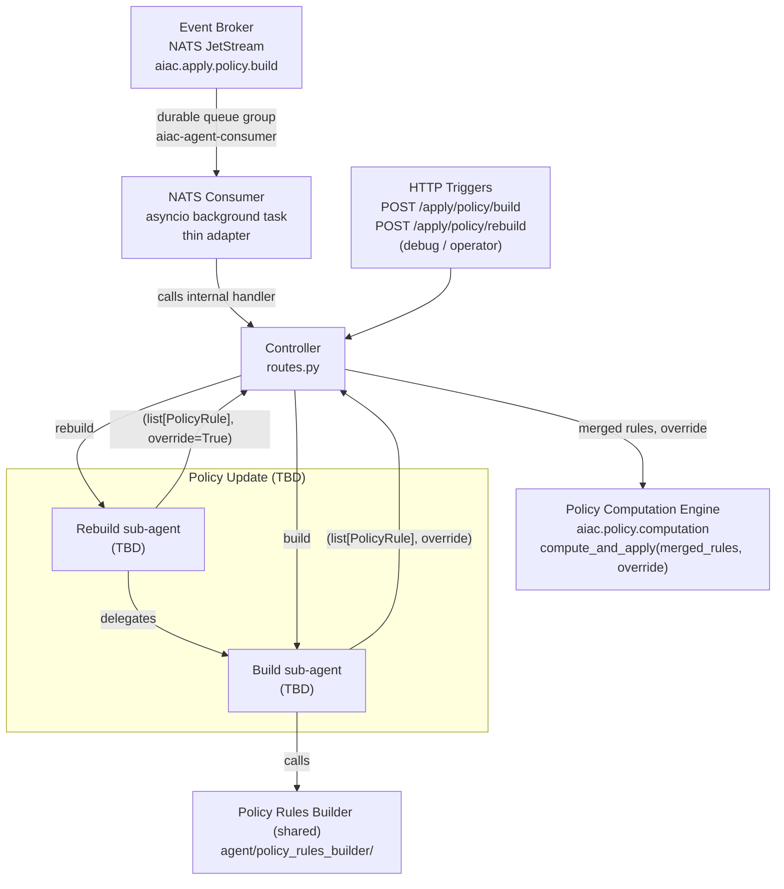

# Component Sub-PRD: UC2 — Policy Update

> **Status: TBD.** The internal design of the Build and Rebuild sub-agents is not yet defined. A dedicated grill session is required.

> **Depends on:** [`../aiac-agent.md`](../aiac-agent.md) — NATS Consumer, Controller, Shared Module, Configuration, Error Handling, Runtime.

> **IdP access — library, not service.** All IdP reads and writes go through the **idp-library** API (`aiac.idp.configuration.api.Configuration`), **never** the IdP Configuration **service** (`aiac.idp.service.configuration.*`) or its HTTP endpoints directly. See [aiac-agent.md → IdP access](../aiac-agent.md#idp-access--library-not-service).

## Triggers

| Source | Subject / Path |
|---|---|
| Event Broker (NATS) | `aiac.apply.policy.build` (originated by RAG Ingest Service post-ingest) |
| HTTP (debug / operator) | `POST /apply/policy/build` |
| HTTP (operator only) | `POST /apply/policy/rebuild` (not routed through Event Broker) |

## Architecture

## What is known

- **Two sub-agents:** Build (responds to `aiac.apply.policy.build` + `POST /apply/policy/build`) and Rebuild (responds to `POST /apply/policy/rebuild` only).
- Build calls the PRB directly, merges the results, and returns `(list[PolicyRule], override)` to the Controller.
- **Composite role flattening:** before calling the PRB, Build flattens every role it reads to its **closure** via the shared `flatten_role` helper — the role plus all descendant roles from `role.childRoles`, de-duplicated by `role.id` (a non-composite role yields just itself). The PRB receives already-flattened roles; the PCE performs no flattening. (Same helper and semantics as UC1 and UC3.)
- Rebuild delegates to Build for rule generation and returns Build's rules to the Controller.
- **Append vs override:** the sub-agent conveys an `override` flag to the Controller alongside its rules. **Rebuild is the full-rebuild case (`override=True`)** — the PCE purges every input role's mappings before applying (see [`../policy-computation-engine.md`](../policy-computation-engine.md)). **Build's** `override` value is **TBD** (whether an incremental post-ingest build appends or replaces).
- The Controller calls `compute_and_apply(merged_rules, override)` via the PCE — the same pattern as all other UCs.
- Internal behavior (how Build/Rebuild sub-agents derive their tuple content, what IdP data they read, whether any LLM node is involved) is **deferred** — to be resolved in a dedicated grill session.

## Out of scope (this stub)

- Build sub-agent internal design.
- Rebuild sub-agent internal design.
- PRB internals — see [`policy-rules-builder.md`](policy-rules-builder.md).
- PCE reconcile mechanics — see [`../policy-computation-engine.md`](../policy-computation-engine.md).
- Response body shape — no success body; handlers return bare HTTP status codes (error responses carry FastAPI's default JSON error body from the raised `HTTPException`). Summary + debug go to the log.
