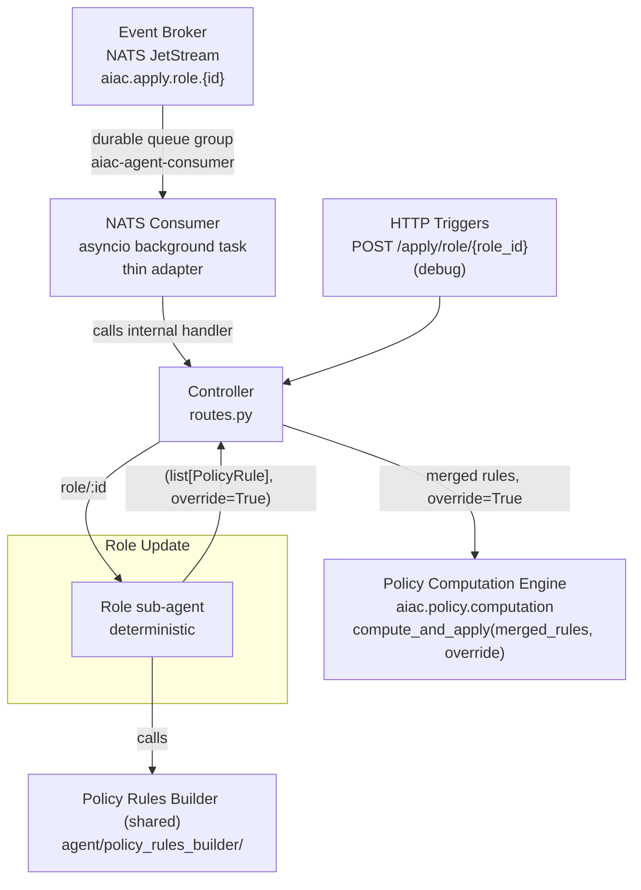

# Component Sub-PRD: UC3 — Role Update

> **Depends on:** [`../aiac-agent.md`](../aiac-agent.md) — NATS Consumer, Controller, Shared Module, Configuration, Error Handling, Runtime.

> **IdP access — library, not service.** All IdP reads and writes go through the **idp-library** API (`aiac.idp.configuration.api.Configuration`), **never** the IdP Configuration **service** (`aiac.idp.service.configuration.*`) or its HTTP endpoints directly. See [aiac-agent.md → IdP access](../aiac-agent.md#idp-access--library-not-service).

## Triggers

| Source | Subject / Path |
|---|---|
| Event Broker (NATS) | `aiac.apply.role.{id}` (originated by Keycloak SPI role created/updated) |
| HTTP (debug) | `POST /apply/role/{role_id}` |

## Architecture

Single path, no create/update branch. The sub-agent is **deterministic** (non-LLM).



## Sub-agent: Role sub-agent

**Nature:** deterministic, non-LLM. Pure IdP reader.

**Steps:**
1. Read the triggering role (`role_id`) from `aiac.idp.configuration.api`.
2. **Flatten the triggering role to its closure** via the shared `flatten_role` helper (see [Composite role flattening](#composite-role-flattening)): the role itself plus all descendant roles from `role.childRoles`, de-duplicated by `role.id`. A non-composite role yields just itself.
3. Read **all scopes** from `aiac.idp.configuration.api`.
4. Call `build_role_rules(r, all_scopes)` on the PRB **once per role `r` in the closure**, and merge the results into a single `list[PolicyRule]`.
5. Return the merged `list[PolicyRule]` (paired with `override=True` — see [Controller behaviour](#controller-behaviour-for-this-uc)).

**Output:** `(list[PolicyRule], override=True)`.

### Composite role flattening

The triggering role is flattened to its **closure** via the shared `flatten_role` helper
(aiac-agent Shared Module): recursively collect the role and all descendant roles from
`role.childRoles` into a flat list, de-duplicated by `role.id` (`Role` is not hashable, so
de-duplication tracks seen `id`s rather than adding `Role` objects to a `set`). A
non-composite role yields a list containing only itself. `build_role_rules` is then called
once per role in the closure, so the PRB receives already-flattened roles and the PCE
performs no further flattening.

## Controller behaviour (for this UC)

1. Receives `(list[PolicyRule], override=True)` from the Role sub-agent (PRB already called and merged internally).
2. Calls `compute_and_apply(rules, override=True)` from `aiac.policy.computation`.
   - With `override=True`, the PCE purges every input role's existing mappings (both directions, plus `target_scopes` reconciliation) before applying the fresh rules — an authoritative role-keyed replace. Because the sub-agent submits `build_role_rules(r, all_scopes)` output for the full closure, this replaces the complete mapping of the triggering role and every descendant. See [`../policy-computation-engine.md`](../policy-computation-engine.md).
3. Returns bare HTTP status; writes summary + debug to log.

## File structure

```
aiac/src/aiac/agent/uc/
└── role_update/
    ├── __init__.py
    ├── graph.py      ← Role sub-agent StateGraph (deterministic)
    ├── nodes.py      ← fetch_role, fetch_all_scopes, package_tuple
    └── state.py      ← RoleUpdateState
```

## Out of scope

- PRB internals — see [`policy-rules-builder.md`](policy-rules-builder.md).
- PCE override (role-keyed replace) mechanics — see [`../policy-computation-engine.md`](../policy-computation-engine.md).
- Response body shape — no success body; handlers return bare HTTP status codes (error responses carry FastAPI's default JSON error body from the raised `HTTPException`). Summary + debug go to the log.
