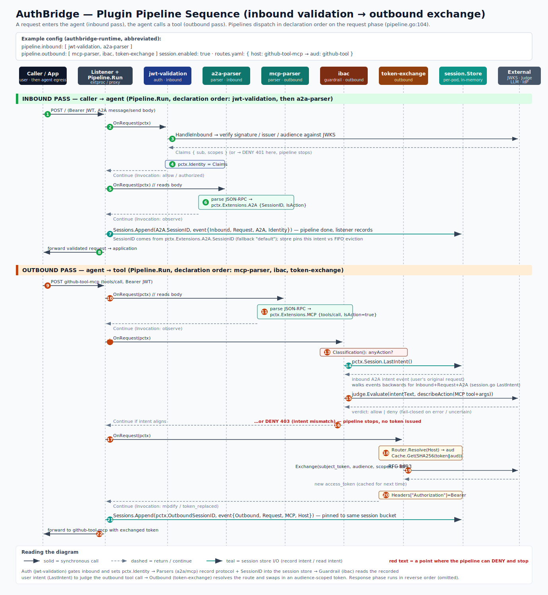

# AuthBridge Plugins

## Overview

**AuthBridge is a sidecar that manipulates inbound and outbound network traffic.**
It sits next to your workload and transparently intercepts HTTP traffic in both
directions: it validates and inspects requests **coming in** to the workload, and
inspects, authorizes, and rewrites requests the workload sends **out** to other
services. No application code changes are required.

AuthBridge is **configured with YAML**. The runtime config selects a deployment
shape (`proxy-sidecar` or `envoy-sidecar`), the listener addresses, the session
store, and — most importantly — the plugin pipelines.

**The heart of the configuration is a set of plugins.** Each direction
(`inbound`, `outbound`) is an ordered list of plugins. A request is dispatched
through that list; each plugin inspects the request and returns an *Action*
(continue, or reject), and may enrich or rewrite the request for later plugins.
Adding, removing, or reordering plugins — and editing each plugin's own `config:`
block — is how you tailor AuthBridge's behavior.

## The plugins

AuthBridge ships nine plugins, grouped by role:

| Plugin | Role | Direction | What it does |
|---|---|---|---|
| **`jwt-validation`** | auth | inbound | Inbound JWT validation (signature, issuer, audience) against JWKS. Sets the caller identity. |
| **`token-exchange`** | auth | outbound | RFC 8693 token exchange per route. Swaps the caller token for an audience-scoped token (Keycloak, Entra ID, Okta, any RFC 8693 IdP). |
| **`token-broker`** | auth | outbound | Exchanges incoming tokens against the configured IdP. |
| **`a2a-parser`** | protocol parser | inbound | Parses A2A (agent-to-agent) JSON-RPC messages into `Extensions.A2A`. |
| **`mcp-parser`** | protocol parser | outbound | Parses MCP tool calls/results into `Extensions.MCP`. |
| **`inference-parser`** | protocol parser | outbound | Parses LLM completion requests/responses into `Extensions.Inference`. |
| **`opa`** | policy | inbound + outbound | OPA/Rego policy enforcement on requests and responses. |
| **`ibac`** | guardrail | outbound | LLM-judge intent-based access control for outbound tool calls. |
| **`sparc`** | guardrail | outbound | Pre-tool reflection: blocks ungrounded / hallucinated tool calls. |

> The combined `authbridge` image compiles in all nine. The size-optimized
> `authbridge-lite` image is the same binary built with `exclude_plugin_*` tags so
> only `jwt-validation` + `token-exchange` remain.

## Example configuration

A typical configuration validates inbound traffic with the auth plugins, lets the
protocol parsers record what is happening, has a guardrail consult the recorded
session, and finally exchanges a token on the way out:

```yaml
# authbridge-runtime (abbreviated)
session:
  enabled: true
pipeline:
  inbound:  [ jwt-validation, a2a-parser ]
  outbound: [ mcp-parser, ibac, token-exchange ]
# routes.yaml: { host: github-tool-mcp → audience: github-tool }
```

The diagram below traces a request through that configuration: an inbound message
is validated and recorded, then the workload's outbound tool call is judged
against the recorded intent and finally re-tokenized.



The pipelines dispatch in **declaration order** on the request phase. On the
inbound pass `jwt-validation` runs first (and can reject with `401`), then
`a2a-parser` records the user's request into the session store. On the outbound
pass `mcp-parser` records the tool call, `ibac` reads the recorded intent to judge
it (and can reject with `403`), and `token-exchange` swaps in an audience-scoped
token. The response phase runs the same plugins in reverse order.

## The `pipeline.Context` data structure

Every plugin implements two methods of the `Plugin` interface:

```go
OnRequest(ctx context.Context, pctx *pipeline.Context) Action
OnResponse(ctx context.Context, pctx *pipeline.Context) Action
```

`pctx` is a **`pipeline.Context`** — the shared, per-request state passed to every
plugin. **Each plugin uses the data in `pctx` to make its decision** and returns an
`Action{Continue}` or `Action{Reject, Violation}`. The same `pctx` instance is
reused across the request pass and the response pass, so a plugin can correlate the
two.

A plugin reads only the fields populated *before it* in declaration order — which
makes plugin ordering a real dependency. The principal fields:

| Field | Set by | Read by (for decisions) |
|---|---|---|
| `Direction` | listener | framework (selects the pipeline) |
| `Method` · `Host` · `Path` | listener (request line) | `jwt-validation`, `mcp-parser`, `ibac`, `sparc`, `token-exchange`, `token-broker`, `opa` |
| `Headers` | listener; **written** by `token-exchange`/`token-broker` (`Authorization`) | `jwt-validation`, `mcp-parser`, `ibac`, `token-exchange`, `token-broker` |
| `Body` | listener (buffered if a plugin `ReadsBody`) | the three protocol parsers |
| `Identity` | **`jwt-validation`** | listener, guardrails |
| `Extensions.A2A` / `.MCP` / `.Inference` | the matching **parser** | parsers (response), `ibac`, `sparc` |
| `Session` | listener (snapshot of the session store) | **`ibac`**, **`sparc`** |
| `Shared` | listener (injects the store); **written** by `jwt-validation` | **`token-exchange`** |
| `StatusCode` · `ResponseHeaders` · `ResponseBody` | listener (response phase) | `opa`, `token-broker`, parsers |

### State that persists beyond a single network event

Most `pctx` fields describe one request. Two fields are different: they let a
plugin acting on one message influence a *different* plugin acting on a *later*
message, tying individual network events together into sessions so that decisions
can be made based on previous interactions.

- **`pctx.Shared`** — a process-scoped key→value store with TTL. A plugin handling
  one message writes a value; a plugin handling a later message in the same request
  flow reads it. Keys today use the `placeholder/` namespace.

- **`pctx.Session`** — a read-only snapshot of the per-conversation **session
  store**. The store accumulates an ordered timeline of events (the inbound user
  request, every outbound tool call, the responses) keyed by the A2A session ID.
  Plugins never write `Session` directly: a parser populates `Extensions.A2A`, and
  the *listener* records the event into the store after the pipeline runs. On a
  later message, the listener snapshots the relevant session back into
  `pctx.Session`, so a guardrail can read the whole conversation so far.

## Two examples of multi-message decisions

### 1. Cross-message credential indirection (`Shared`)

A decision that spans the **inbound message** (where a credential arrived) and a
**later outbound message** (the workload's egress call):

1. On the **inbound** request, `jwt-validation` validates the JWT, mints an opaque
   handle, replaces the `Authorization` header with that handle so the real token
   never reaches the application, and writes the real token into `pctx.Shared`
   keyed by the handle.
2. When the workload later makes an **outbound** call carrying that handle,
   `token-exchange` reads `pctx.Shared` to recover the real token. If the entry is
   missing or expired it **fails closed (401)**; otherwise it has the subject token
   it needs to perform the RFC 8693 exchange.

The outbound plugin's decision depends entirely on what the inbound plugin
recorded a message earlier.

### 2. Intent-based access control across a conversation (`Session`)

A decision that spans the **inbound user request** (turn N) and a **subsequent
outbound tool call** the agent makes while servicing it:

1. On the **inbound** A2A request, `a2a-parser` records the user's intent. The
   listener appends it to the session store under the conversation's session ID,
   where it is pinned against eviction as the conversation's *last intent*.
2. When the agent then issues an **outbound** tool call, `ibac` reads
   `pctx.Session.LastIntent()` to recover what the user actually asked for, and
   asks an LLM judge whether the tool call aligns with that intent. Aligned →
   **continue**; mismatch → **reject (403)**, before any token is issued.

`sparc` makes a related multi-message decision: it reads
`pctx.Session.InferenceRequests()` for grounding context and `pctx.Session.ID` to
key its reflection track, then blocks tool calls that aren't grounded in the
conversation so far.

In both cases AuthBridge is deciding on the *current* message using information
recorded from *earlier* messages — the essence of the session-aware design.
