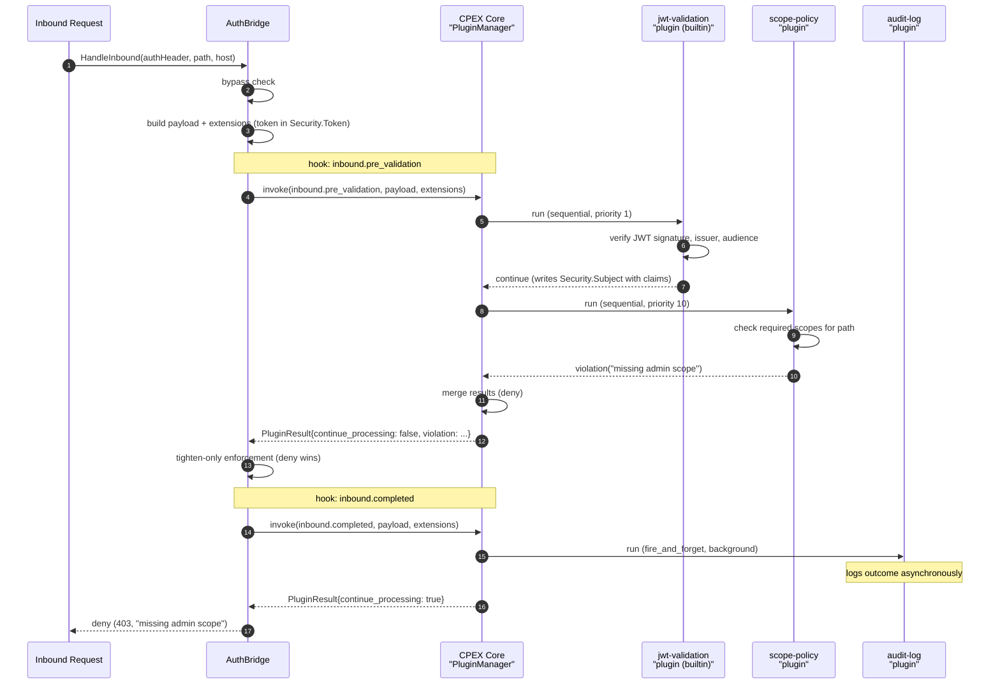

# AuthBridge Hook System and CPEX Integration

**Status**: Draft
**Date**: April 2026

This document specifies the hook system and plugin runtime for AuthBridge. Hooks provide typed, capability-gated extension points at well-defined stages of the inbound JWT validation and outbound token exchange pipelines. The plugin runtime is built on [CPEX](https://github.com/contextforge-org/contextforge-plugins-framework/tree/main), embedded in-process via Go bindings to the Rust core.

### How it works

AuthBridge defines **hooks** (named extension points at each stage of inbound and outbound processing) and their **typed payloads** (the data available at each hook). At startup, AuthBridge imports and initializes a CPEX `PluginManager`, which loads configured plugins and registers their hook subscriptions. On each request, AuthBridge constructs the payload and extensions at each hook point and hands them to CPEX. CPEX handles plugin dispatch (phase ordering, parallel execution, capability gating) and returns an aggregate `PluginResult`. AuthBridge then applies the result, enforcing tighten-only composition, short-circuit behavior, and error handling.

In short: **CPEX provides the hook system API, plugin runtime, and policy composition model. AuthBridge uses CPEX to define its hooks and payloads, and owns the enforcement of results.** For the detailed responsibility split, see [§7.5: What CPEX provides vs. what AuthBridge provides](#75-what-cpex-provides-vs-what-authbridge-provides).

**Request flow (inbound example):**



## Table of Contents

1. [Introduction](#1-introduction)
2. [CPEX Terminology](#2-cpex-terminology)
3. [Hook Catalog](#3-hook-catalog)
4. [Hook Payloads](#4-hook-payloads)
5. [Dispatch Semantics](#5-dispatch-semantics)
6. [Configuration](#6-configuration)
7. [Integration Architecture](#7-integration-architecture)
8. [Built-in Plugin Migration](#8-built-in-plugin-migration)
9. [Adapter Layer](#9-adapter-layer)
10. [Security Invariants and Hook Mapping](#10-security-invariants-and-hook-mapping)
11. [Observability](#11-observability)
12. [Staged Rollout](#12-staged-rollout)
13. [Layering Model and Protocol-Semantic Hooks](#13-layering-model-and-protocol-semantic-hooks)
14. [Open Questions](#14-open-questions)
15. [Appendices](#appendices)

Out of scope:

- CPEX internals (payload dispatch, capability gating, plugin executor). See the [CPEX spec](https://github.com/contextforge-org/contextforge-plugins-framework/blob/main/docs/specs/plugin-framework-spec.md) and [CPEX Go API](https://github.com/contextforge-org/contextforge-plugins-framework/blob/docs/golang_proposal/docs/proposals/cpex-golang-bindings-proposal.md).
- Protocol-semantic hooks for MCP, A2A, or LLM payloads. [How protocol-semantic hooks ship later](#133-how-protocol-semantic-hooks-ship-later) explains why they are deferred.
- Hot-swapping plugins at runtime. Plugins are loaded at startup and released on shutdown.

## 1. Introduction

### 1.1 Goals

- **Fill gaps in existing interfaces.** The `Verifier`, `ClientAuth`, and `ActorTokenSource` interfaces handle their specific concerns well. They don't cover cross-cutting observation (audit, metrics), policy enforcement at stages they don't expose (post-bypass, pre-exchange), or out-of-process dispatch. Hooks fill those gaps.
- **Share a CPEX runtime.** Plugins targeting AuthBridge hooks can also target Praxis and ContextForge where payload types overlap. A JWT validation plugin written once runs in all three hosts.
- **Stay within latency budget.** Observation hooks < 1 ms; validate hooks < 5 ms per request. Native plugin overhead stays in single-digit microseconds per hook. See [Failure modes and timeouts](#53-failure-modes-and-timeouts).
- **Tighten-only composition.** Plugins may strengthen any security boundary. They cannot silently weaken any. See [Tighten-only composition](#54-tighten-only-composition).
- **Zero cost when unused.** Deployments without a `plugins:` section pay a single nil check per call site. No dispatcher traversal, no allocations, no MessagePack serialization.
- **Ecosystem access.** AuthBridge gains access to the CPEX plugin ecosystem (identity resolver, PII guard, rate limiter, audit logger, token delegation, APL policy evaluator), all pre-built and shared across hosts.

### 1.2 Non-Goals

- **Replacing existing auth logic.** `HandleInbound()` and `HandleOutbound()` remain the orchestration layer. Hooks wrap the pipeline, not the other way around.
- **Hot reload.** Startup-only loading keeps the trust model simple. Reload-without-restart is deferred.
- **Arbitrary cross-hook ordering.** Within a hook point, plugins run in CPEX phase order at configured priority. Across hook points, order follows the request lifecycle.
- **Semantic payload parsing.** MCP, A2A, and LLM protocol parsing should not be implemented in the auth layer. See [Layering Model](#13-layering-model-and-protocol-semantic-hooks).

## 2. CPEX Terminology

This section defines CPEX concepts used throughout this spec. For full details, see the [CPEX Plugin Framework Spec](https://github.com/contextforge-org/contextforge-plugins-framework/blob/main/docs/specs/plugin-framework-spec.md) and the [CPEX Go API](https://github.com/contextforge-org/contextforge-plugins-framework/blob/docs/golang_proposal/docs/proposals/cpex-golang-bindings-proposal.md).

| Term | Definition |
|---|---|
| **PluginMode** | Execution phase for a plugin subscription: `sequential` (serial, can block + modify), `transform` (serial, modify only), `audit` (serial, read-only), `concurrent` (parallel, can block), `fire_and_forget` (background, non-blocking). Configured per subscription in YAML. |
| **Extensions** | Typed metadata attached to a payload: `Security`, `Http`, `Meta`, `Delegation`, `Custom`, etc. Each plugin sees only the extensions its declared capabilities grant. |
| **PluginResult** | Aggregate result from a hook invocation: `continue_processing` (allow), `modified_payload` (mutated copy), or `violation` (deny with reason). |
| **PluginViolation** | Structured denial: `reason`, `description`, `code`, `details`. Carried in `PluginResult.violation`. |
| **ContextTable** | Per-plugin state that persists across hook invocations within a single request. Passed between hook calls to preserve plugin-local data. |
| **BackgroundTasks** | Fire-and-forget async work spawned by plugins. Runs after the hook pipeline completes, outside the request's latency budget. |
| **PluginManager** | CPEX lifecycle manager: loads plugins, registers hook subscriptions, dispatches invocations, and handles shutdown. |
| **OnError** | Per-plugin error handling: `fail` (halt pipeline), `ignore` (log and continue), `disable` (log, disable plugin, continue). |
| **Capability** | A declared permission (e.g., `read_security`, `read_token`, `write_http`) that controls which Extensions a plugin can access or modify. |

The hook catalog uses three shorthand labels for mode:

| Label | Meaning | Allowed `PluginMode` values |
|---|---|---|
| **observe** | Read-only, cannot block or modify | `audit`, `fire_and_forget` |
| **validate** | Can block (deny) but cannot modify the payload | `sequential`, `concurrent` |
| **modify** | Can modify the payload via copy-on-write | `transform` |

## 3. Hook Catalog

### 3.1 Conventions

- **ID** is a stable short identifier: `S` startup, `I` inbound, `O` outbound, `A` audit. IDs are stable across the API lifetime; payload types evolve under semver.
- **Name** is the string CPEX registers and the value operators write in YAML `subscribe:` blocks.
- **Mode** is the CPEX plugin mode: `observe`, `validate`, or `modify`. See [CPEX Terminology](#2-cpex-terminology). Where an observe hook runs in the background (fire-and-forget), it is noted as `observe (background)`.
- **Use Cases** lists concrete things you'd build at this hook point.

### 3.2 Startup hooks

| ID | Name | Call site | Mode | Use Cases |
|---|---|---|---|---|
| S1 | `startup.config_loaded` | `main.go` after `config.Resolve()` | validate | Config validation, reject insecure options, environment checks |
| S2 | `startup.plugins_ready` | `main.go` after `mgr.Initialize()` | observe | Service discovery registration, cache warming, readiness signaling |
| S3 | `startup.shutdown` | `main.go` on SIGTERM path | observe | Flush buffered state, deregister from service discovery, close connections |

**Why three startup hooks?** S1 catches invalid config before any listener accepts traffic, so a production-hardening plugin can reject `insecure_options` at that point. S2 signals readiness for external integrations. S3 ensures clean shutdown.

### 3.3 Inbound hooks

| ID | Name | Call site | Mode | Use Cases |
|---|---|---|---|---|
| I1 | `inbound.received` | `HandleInbound()` entry | observe | Request logging, rate-limit probes, request tagging |
| I2 | `inbound.pre_validation` | After bypass check, before `verifier.Verify()` | validate | IP allowlist, custom token format support, external authz gateway, short-circuit before JWT validation |
| I3 | `inbound.post_validation` | After `verifier.Verify()` succeeds | validate | Scope-based access control, claim enrichment from external store, custom audience checks, role mapping |
| I4 | `inbound.decision` | Before returning inbound result | validate | Final inbound gate, maintenance mode, global deny policies, cross-cutting authorization |
| I5 | `inbound.completed` | After result is determined | observe (background) | Terminal audit with outcome (allow/deny, claims, latency), analytics export |

**Extensions available per hook:**

| Extension | I1 | I2 | I3 | I4 | I5 |
|---|---|---|---|---|---|
| `Meta` (Tags, Scope, Properties) | yes | yes | yes | yes | yes |
| `Security.Agent` (ClientID, WorkloadID, TrustDomain) | yes | yes | yes | yes | yes |
| `Security.Subject` (SubjectID, Issuer, Audience, Scopes, Claims) | - | - | yes | yes | yes |
| `Security.Token` (raw bearer, requires `read_token`) | - | yes | yes | yes | yes |
| `Http` (Method, Path, Host, RequestHeaders — requires `read_http`) | yes | yes | yes | yes | yes |

### 3.4 Outbound hooks

| ID | Name | Call site | Mode | Use Cases |
|---|---|---|---|---|
| O1 | `outbound.received` | `HandleOutbound()` entry | observe | Request logging, outbound tracking |
| O2 | `outbound.post_route` | After `router.Resolve()` | validate | Route-based policy, audience override, scope narrowing, deny before exchange |
| O3 | `outbound.pre_exchange` | Before `exchanger.Exchange()` | modify | Scope attenuation, dynamic audience derivation, actor token injection, token endpoint override |
| O4 | `outbound.post_exchange` | After successful `exchanger.Exchange()` | validate | Token inspection, delegation chain validation, cache policy override |
| O5 | `outbound.decision` | Before returning outbound result | validate | Final outbound gate, global outbound policies |
| O6 | `outbound.completed` | After result is determined | observe (background) | Terminal audit with outcome (allow/replace/deny, host, latency), analytics export |

**Extensions available per hook:**

| Extension | O1 | O2 | O3 | O4 | O5 | O6 |
|---|---|---|---|---|---|---|
| `Meta` (Tags, Scope, Properties) | yes | yes | yes | yes | yes | yes |
| `Security.Agent` (ClientID, WorkloadID, TrustDomain) | yes | yes | yes | yes | yes | yes |
| `Security.Subject` (SubjectID, Issuer, Audience, Scopes, Claims) | * | * | * | * | * | * |
| `Security.Token` (raw bearer, requires `read_token`) | - | - | yes | yes | yes | yes |
| `Http` (Method, Path, Host, RequestHeaders — requires `read_http`) | yes | yes | yes | yes | yes | yes |
| `Delegation.Chain` (actor token delegation hops) | - | - | yes | yes | yes | yes |

\* Available if inbound validation ran before outbound (e.g., waypoint mode).

### 3.5 Cross-cutting hooks

| ID | Name | Call site | Mode | Use Cases |
|---|---|---|---|---|
| A1 | `audit.request_logged` | After both inbound and outbound complete | observe (background) | Combined audit record for the full request lifecycle, compliance logging |

Fires exactly once per request in modes where both inbound and outbound execute (waypoint).

## 4. Hook Payloads

Each hook in the [catalog](#3-hook-catalog) has a typed payload that AuthBridge constructs from request context before invoking CPEX. These are AuthBridge-specific types, not CPEX built-ins. CPEX operates on any `PluginPayload`; the structs below are the concrete payloads for AuthBridge's auth lifecycle hooks.

### 4.1 Shared context type

Every hook receives an `AuthBridgeHookCtx` providing ambient context:

```go
type AuthBridgeHookCtx struct {
    Direction    string    // "inbound", "outbound", or "startup"
    Mode         string    // "envoy-sidecar", "waypoint", "proxy-sidecar"
    RequestID    string    // unique per request (UUID)
    Timestamp    int64     // Unix nanos at hook invocation
}
```

`Direction` is included for cross-cutting plugins that subscribe to hooks in multiple families (e.g., a single audit plugin handling both I5 and O6) and need to branch on direction without inspecting the hook name.

### 4.2 Startup payloads

```go
// S1: startup.config_loaded
type ConfigLoadedPayload struct {
    Ctx    AuthBridgeHookCtx
    Mode   string            // deployment mode
    Config map[string]any    // serialized config (no secrets)
}

// S2: startup.plugins_ready
type PluginsReadyPayload struct {
    Ctx          AuthBridgeHookCtx
    PluginCount  int
    PluginNames  []string
}

// S3: startup.shutdown
type ShutdownPayload struct {
    Ctx            AuthBridgeHookCtx
    DeadlineUnixNs int64  // shutdown deadline
}
```

### 4.3 Inbound payloads

```go
// I1: inbound.received
type InboundReceivedPayload struct {
    Ctx      AuthBridgeHookCtx
    Path     string
    HasAuth  bool    // whether Authorization header is present
    Bypassed bool    // whether path matched bypass patterns
}

// I2: inbound.pre_validation
type InboundPreValidationPayload struct {
    Ctx      AuthBridgeHookCtx
    Path     string
    Audience string  // expected audience for validation
}
// Result: PluginResult — deny skips validation and denies the request.

// I3: inbound.post_validation
type InboundPostValidationPayload struct {
    Ctx       AuthBridgeHookCtx
    Path      string
    Validated bool   // true if JWT was valid
}
// Claims are carried in Extensions.Security.Subject (populated from validation results).

// I4: inbound.decision
type InboundDecisionPayload struct {
    Ctx    AuthBridgeHookCtx
    Action string  // "allow" or "deny" (built-in decision)
    Path   string
}
// Result: PluginResult — deny overrides allow; allow cannot override deny (tighten-only).

// I5: inbound.completed
type InboundCompletedPayload struct {
    Ctx        AuthBridgeHookCtx
    Action     string  // final action
    Path       string
    DenyStatus int     // 0 if allowed
    DenyReason string
    DurationNs int64   // time spent in HandleInbound
}
```

### 4.4 Outbound payloads

```go
// O1: outbound.received
type OutboundReceivedPayload struct {
    Ctx     AuthBridgeHookCtx
    Host    string
    HasAuth bool
}

// O2: outbound.post_route
type OutboundPostRoutePayload struct {
    Ctx         AuthBridgeHookCtx
    Host        string
    Matched     bool    // whether a configured route matched
    Audience    string
    Scopes      string
    Passthrough bool
}
// Result: deny aborts before exchange.

// O3: outbound.pre_exchange (modify mode)
type OutboundPreExchangePayload struct {
    Ctx           AuthBridgeHookCtx
    Host          string
    Audience      string
    Scopes        string
    TokenEndpoint string
    HasActorToken bool
}
// Result: ModifiedPayload can change Audience, Scopes, TokenEndpoint.

// O4: outbound.post_exchange
type OutboundPostExchangePayload struct {
    Ctx       AuthBridgeHookCtx
    Host      string
    Audience  string
    ExpiresIn int   // seconds
    CacheHit  bool
}
// The exchanged token is NOT in the payload. It is in Extensions.Security.Token (capability-gated).

// O5: outbound.decision
type OutboundDecisionPayload struct {
    Ctx    AuthBridgeHookCtx
    Action string  // "allow", "replace_token", or "deny"
    Host   string
}

// O6: outbound.completed
type OutboundCompletedPayload struct {
    Ctx        AuthBridgeHookCtx
    Action     string
    Host       string
    DenyStatus int
    DenyReason string
    CacheHit   bool
    DurationNs int64
}
```

### 4.5 Cross-cutting payloads

```go
// A1: audit.request_logged
type RequestLoggedPayload struct {
    Ctx             AuthBridgeHookCtx
    InboundAction   string  // "" if inbound was not executed
    OutboundAction  string  // "" if outbound was not executed
    Host            string
    Path            string
    TotalDurationNs int64
}
```

### 4.6 Extension population

At each hook invocation, AuthBridge populates CPEX `Extensions` from internal state. The per-hook availability tables in [§3.3](#33-inbound-hooks) and [§3.4](#34-outbound-hooks) show which extensions are present at each hook. The following table summarizes how AuthBridge concepts map to CPEX extension fields.

| Extension field | Populated from | Notes |
|---|---|---|
| `Meta.Tags` | Deployment mode + conditional flags (e.g., `["envoy-sidecar", "bypassed"]`) | Set by AuthBridge at invocation time from runtime state, not from hook config. Plugins can use tags in policy conditions to vary behavior by deployment mode. |
| `Meta.Properties` | Route resolution: `{"audience": ..., "scopes": ..., "no_token_policy": ...}` | Available after route resolution (O2+) |
| `Security.Subject.SubjectID` | JWT `sub` claim | Available after validation (I3+) |
| `Security.Subject.Issuer` | JWT `iss` claim | Available after validation (I3+) |
| `Security.Subject.Audience` | JWT `aud` claim | Available after validation (I3+) |
| `Security.Subject.ClientID` | OAuth `client_id` | Available after validation (I3+) |
| `Security.Subject.Scopes` | OAuth scope | Available after validation (I3+) |
| `Security.Subject.Claims` | All raw JWT claims | Available after validation (I3+) |
| `Security.Agent.WorkloadID` | SPIFFE URI (e.g., `spiffe://localtest.me/ns/team1/sa/weather-tool`) | Workload identity — always available |
| `Security.Agent.ClientID` | OAuth client ID from `IdentityConfig` | Always available |
| `Security.AuthMethod` | `"jwt"`, `"spiffe"`, or `"client-secret"` | Always available |
| `Security.Token` | Raw bearer token | **Capability-gated**: requires `read_token` |
| `Http.Method` | From protocol adapter | Always available |
| `Http.Path` | From protocol adapter | Always available |
| `Http.Host` | From protocol adapter | Always available |
| `Http.RequestHeaders` | Request headers from protocol adapter | **Capability-gated**: requires `read_http` |
| `Delegation.Chain` | Actor token delegation hops | Available when actor token is present (O3+) |
| `Labels` | Accumulated security labels | Monotonic: can only grow |
| `Custom` | `{"route.matched": bool, "cache.hit": bool, ...}` | Context-dependent |

**Extension notes:**

- **`Security.Subject`**: carries first-class fields for OAuth/JWT identity (`SubjectID`, `Issuer`, `Audience`, `ClientID`, `Scopes`) alongside a `Claims` dict for the full raw claim set.
- **`Security.Agent`**: carries the workload identity of the AuthBridge instance itself (`ClientID`, `WorkloadID` as SPIFFE URI, `TrustDomain`).
- **`Http`**: carries HTTP request primitives (`Method`, `Path`, `Host`, `RequestHeaders`) from the protocol adapter.
- **`Delegation`**: carries the token delegation chain. Each `DelegationStep` records who delegated to whom, with what scopes, and via what strategy. AuthBridge populates this from actor tokens during outbound processing.

### 4.7 Mapping AuthBridge concepts to CPEX types

| AuthBridge concept | CPEX Extension mapping |
|---|---|
| `auth.IdentityConfig{ClientID, Audience}` | `Security.Agent{ClientID, WorkloadID, TrustDomain}` |
| `validation.Claims{Subject, Issuer, Audience, ClientID, Scopes, Extra}` | `Security.Subject{SubjectID, Issuer, Audience, ClientID, Scopes, Claims}` |
| `routing.ResolvedRoute{Audience, Scopes, Passthrough}` | `Meta{Properties: {"audience": ..., "scopes": ...}}` |
| `auth.InboundResult{Action, Claims, DenyStatus}` | `PluginResult{continue_processing, violation}` |
| `auth.OutboundResult{Action, Token, DenyStatus}` | `PluginResult{continue_processing, modified_payload}` |
| Actor token chain | `Delegation{Chain: []DelegationStep{Delegator, Delegate, Scopes, ...}}` |
| Request headers | `Http{Method, Path, Host, RequestHeaders}` |
| Direction (inbound/outbound) | Separate hook families: `inbound.*` vs `outbound.*` |

## 5. Dispatch Semantics

### 5.1 Mode-to-phase mapping

The catalog uses shorthand labels (`observe`, `validate`, `modify`) to describe what each hook allows. These map to CPEX's `PluginMode` enum values that plugins configure in YAML:

| Catalog label | Allowed `PluginMode` values (YAML `mode:`) | Default |
|---|---|---|
| observe | `audit`, `fire_and_forget` | Per catalog (see [§3](#3-hook-catalog)) |
| validate | `sequential`, `concurrent` | `sequential` |
| modify | `transform` | `transform` |

AuthBridge validates at startup that each plugin subscription uses a `PluginMode` compatible with the hook's catalog label. Within a phase, plugins run by ascending `priority:`, then YAML position. Across phases, CPEX uses its canonical order: sequential → transform → audit → concurrent → fire-and-forget.

### 5.2 Result handling per mode

After the CPEX executor returns a `PluginResult`, the call site applies it per mode:

| Mode | `ContinueProcessing=true` | `ContinueProcessing=false` | `ModifiedPayload` |
|---|---|---|---|
| observe | proceed | log at error, proceed | discarded |
| modify | proceed | log at error, proceed | replace payload, re-validate via `HookPayloadPolicy` |
| validate | proceed | abort per [Short-circuit behavior](#56-short-circuit-behavior) | accepted in `sequential` only; `concurrent` cannot mutate |

A plugin returning a modified payload with forbidden field changes fails per its `on_error:` setting.

**Why modify mode cannot block:** Transform-mode plugins exist to mutate payloads (e.g., rewriting the audience before token exchange), not to make allow/deny decisions. If a transform plugin returns `ContinueProcessing=false`, it is treated as a plugin error, and the pipeline logs it and proceeds according to the plugin's `on_error:` setting. Policy decisions belong in `validate` hooks.

### 5.3 Failure modes and timeouts

Each plugin has `on_error:` (from CPEX: `fail`, `ignore`, `disable`) and `timeout_ms:`. Defaults:

| Mode | Default `on_error` | Default `timeout_ms` |
|---|---|---|
| observe | ignore | 50 |
| modify | fail | 20 |
| validate | fail | 100 |
| startup (S1) | fail | 5000 |
| background (I5, O6, A1) | ignore | 200 |

**Why these budgets?** AuthBridge handles every request in a pod. A 100 ms validate timeout keeps the worst case under Envoy's ext_proc deadline (default 200 ms). Observation hooks at 50 ms leave headroom. Background hooks are non-blocking, so their timeout only affects resource cleanup.

### 5.4 Tighten-only composition

All parties (built-in check + all plugins) must agree to allow. Any single deny wins.

For every `validate` hook, plugin results compose with the built-in check via a monoid that can only tighten:

```
Built-in Allow + Plugin Allow  → Allow
Built-in Allow + Plugin Deny   → Deny   (plugin tightens)
Built-in Deny  + Plugin Allow  → Deny   (cannot weaken)
Built-in Deny  + Plugin Deny   → Deny
```

This is enforced in the dispatcher's reduce step, not per call site. A plugin voting "allow" never overrides a built-in "deny".

**When does a plugin see a built-in deny?** At decision hooks (I4, O5), the built-in result is already determined. The plugin receives the built-in decision in the payload (e.g., `InboundDecisionPayload.Action = "deny"`). A plugin can observe the deny for audit purposes but cannot override it to allow. At earlier hooks (I2, I3, O2, O4), the built-in has not decided yet. The plugin can deny preemptively via short-circuit, but the built-in has not yet had a chance to allow or deny.

**Example:** Built-in validation allows a request (valid JWT, correct audience). The `scope-policy` plugin denies it because the `admin` scope is missing. Result: **denied**. The plugin tightened the decision.

For outbound decision hooks (O5), the same principle applies to action types:

```
Tighten order: Allow < ReplaceToken < Deny
```

A plugin can escalate from Allow to Deny, but cannot de-escalate from Deny to Allow.

### 5.5 HookPayloadPolicy

CPEX's `HookPayloadPolicy` declares writable fields for `transform` and `sequential` phases:

| Hook | Writable | Forbidden |
|---|---|---|
| O3 (pre_exchange) | `Audience`, `Scopes`, `TokenEndpoint` | `Host`, `Ctx` (read-only context) |
| I4 (inbound.decision) | (no payload mutation, only allow/deny) | all payload fields |
| O5 (outbound.decision) | (no payload mutation, only allow/deny) | all payload fields |

Violations are treated per the plugin's `on_error:`.

### 5.6 Short-circuit behavior

| Hook | What "short-circuit" does |
|---|---|
| S1 (config_loaded) | `main.go` exits with non-zero status. No listener starts. |
| I2 (pre_validation) | JWT validation skipped. `HandleInbound()` returns deny with the plugin's violation. |
| I3 (post_validation) | `HandleInbound()` returns deny with the plugin's violation. Claims already validated. |
| I4 (inbound.decision) | Overrides the built-in result. Tighten-only: can deny but not allow a denied request. |
| O2 (post_route) | Token exchange skipped. `HandleOutbound()` returns deny. |
| O3 (pre_exchange) | Cannot short-circuit (modify mode). Exchange proceeds with modified or original params. |
| O4 (post_exchange) | `HandleOutbound()` returns deny. Token is discarded. |
| O5 (outbound.decision) | Overrides the built-in result. Tighten-only. |

## 6. Configuration

### 6.1 YAML surface

AuthBridge's existing YAML config gains a `plugins:` section. All existing sections are unchanged.

```yaml
mode: envoy-sidecar
inbound:
  issuer: ${ISSUER}
outbound:
  keycloak_url: ${KEYCLOAK_URL}
  keycloak_realm: ${KEYCLOAK_REALM}

plugins:
  - name: scope-policy
    kind: native:///opt/authbridge/plugins/libscopepolicy.so
    subscribe:
      - hook: inbound.post_validation   # I3
        mode: sequential
        priority: 10
        on_error: fail
        timeout_ms: 50
    capabilities:
      - read_security
    config:
      required_scopes:
        /api/v1/admin: ["admin"]

  - name: audit-log
    kind: wasm:///opt/authbridge/plugins/audit.wasm
    subscribe:
      - hook: inbound.completed          # I5
        mode: fire_and_forget
      - hook: outbound.completed          # O6
        mode: fire_and_forget
    capabilities:
      - read_security
      - read_http
    config:
      sink: https://audit.internal/v1/events
```

### 6.2 Field semantics

| Field | Required | Meaning |
|---|---|---|
| `name` | yes | Unique plugin identifier; used in logs and metrics. |
| `kind` | yes | Scheme-prefixed location: `native://`, `wasm://`, `builtin:<name>`. Selects the host. |
| `version` | no | Advisory string, logged at startup. |
| `subscribe[].hook` | yes | Hook name from the [catalog](#3-hook-catalog). |
| `subscribe[].mode` | no | CPEX `PluginMode` value (`sequential`, `transform`, `audit`, `concurrent`, `fire_and_forget`); default from the catalog; validated against the hook's allowed modes. |
| `subscribe[].priority` | no | Ordering within a phase; default 100. |
| `subscribe[].on_error` | no | Default per mode (see [Failure modes](#53-failure-modes-and-timeouts)). |
| `subscribe[].timeout_ms` | no | Default per mode (see [Failure modes](#53-failure-modes-and-timeouts)). |
| `capabilities` | no | Declared capabilities for extension gating. |
| `config` | no | Opaque plugin-specific YAML; handed to `Plugin::initialize` as JSON. |

### 6.3 Startup validation

Startup fails when:

- Two plugins share a `name`.
- A `subscribe[].hook` is not a registered AuthBridge hook.
- A `subscribe[].mode` is not allowed for the hook's mode (see [§5.1](#51-mode-to-phase-mapping)).
- A plugin's `Plugin::initialize` returns an error with `on_error: fail`.
- Any S1 plugin rejects the config.
- A required plugin is missing from the `plugins:` list.

### 6.4 Backward compatibility

When no `plugins:` section is present in config:

- `PluginManager` is nil.
- `HandleInbound()` / `HandleOutbound()` execute as today.
- Zero overhead: a single `if dispatcher == nil` check per request.
- Existing deployments work unchanged without any configuration modification.

### 6.5 Environment interpolation

Existing `${ENV_VAR}` resolution in `config.Load()` applies to `plugins[].config`. Secrets should flow through env vars, not YAML literals.

## 7. Integration Architecture

### 7.1 CPEX plugin runtime

AuthBridge embeds CPEX via its Go SDK (`cpex-go`). The plugin executor dispatches to all registered plugins natively. AuthBridge provides lifecycle call sites, payload construction, extension population, and the tighten-only composition logic.

```
AuthBridge (Go host)
│
├── Go Host Layer (cpex-go)
│   ├── PluginManager wrapper (lifecycle, invoke)
│   ├── Config loading (CPEX config adapter)
│   └── Result handling + tighten-only enforcement
│
├── C FFI boundary (single crossing per invoke)
│
└── CPEX Core (cpex-core)
    ├── Plugin instances (native)
    ├── Plugin executor
    ├── Capability gating (per-plugin extension filtering)
    ├── ContextTable (per-plugin cross-hook state)
    └── Background tasks (fire-and-forget async work)
```

### 7.2 Package layout

A single new package joins the AuthBridge Go module structure.

```
authbridge/
  authlib/
    hooks/                        NEW: authbridge hooks package
      hooks.go                    Hook type IDs, registration, public types
      payloads.go                 Payload and result Go structs per hook
      dispatcher.go               HookDispatcher wrapping cpex.PluginManager
      extensions.go               AuthBridge → CPEX Extensions population
      tighten.go                  Tighten-only composition logic
      config.go                   YAML → CPEX config adapter
      metrics.go                  authbridge_hook_* metric emitters
    auth/                         MODIFIED: call sites added to HandleInbound/HandleOutbound
    config/                       MODIFIED: plugins section added to Config
  cmd/authbridge/
    main.go                       MODIFIED: PluginManager lifecycle
```

Go module dependencies:

```go
require (
    github.com/contextforge/cpex-go v0.2.0
)
```

The `cpex-go` package includes pre-built Rust shared libraries for linux/amd64, linux/arm64, and darwin/arm64. Building with `CGO_ENABLED=0` produces a binary that rejects all plugins at startup.

### 7.3 Lifecycle integration

The `PluginManager` is created in `main.go`, after config resolution and before listener startup.

```
cmd/authbridge/main.go
  flag.Parse()
  config.Load(configPath)
  config.Resolve(ctx, cfg) → auth.Config
  ── if cfg has plugins section ──────────────────
  │  hooks.NewDispatcher(cfg.Plugins)            NEW
  │    cpex.NewPluginManager(yaml)
  │    mgr.Initialize()
  │    dispatch S1 config_loaded (fail-closed)
  │    dispatch S2 plugins_ready (observe)
  ─────────────────────────────────────────────────
  auth.New(resolved, dispatcher)                 MODIFIED
  startListeners(...)
  go resolveCredentials(...)
  <-sigCh
  dispatch S3 shutdown (observe)
  mgr.Shutdown()
```

The `auth.Auth` struct receives an optional `*hooks.Dispatcher`. A nil dispatcher (no `plugins:` section) collapses every call site to a single `dispatcher == nil` branch, leaving the existing code path unchanged.

### 7.4 Call-site contract

Every call site in the [hook catalog](#3-hook-catalog) must:

1. **Fast-path check**: `if d.HasHooksFor(hookID)`, backed by an `AtomicBool` per hook ID.
2. **Build payload**: construct the typed payload from local context.
3. **Populate extensions**: build `cpex.Extensions` from AuthBridge's internal state.
4. **Invoke**: `result, bg, err := d.Invoke(hookID, payload, extensions, contextTable)`.
5. **Apply result**: per the hook's mode (see [Result handling](#52-result-handling-per-mode)).
6. **Emit metric**: per-hook-pair counter and histogram.

Call sites use a helper that keeps boilerplate out of the hot path:

```go
if d != nil && d.HasHooksFor(hooks.InboundPostValidation) {
    ext := d.BuildExtensions(ctx, direction, claims, route, headers)
    result, bg, _ := d.Invoke(hooks.InboundPostValidation, payload, ext, ctxTable)
    bg.Close()
    if result.IsDenied() {
        return denyFromViolation(result.Violation)
    }
}
```

### 7.5 What CPEX provides vs. what AuthBridge provides

| CPEX provides | AuthBridge provides |
|---|---|
| `PluginManager` — lifecycle management, plugin loading, hook invocation | Hook type definitions (IDs, payload/result types) |
| Plugin executor — runs plugins in 5-phase order (`PluginMode`) with priority scheduling | Call sites in `HandleInbound()` / `HandleOutbound()` |
| Capability gating — filters Extensions per-plugin based on declared capabilities | Extension population from internal state (JWT claims → `Security.Subject`, etc.) |
| `PluginResult` — typed result with `continue_processing`, `modified_payload`, `violation` | Tighten-only enforcement per mode |
| `ContextTable` — per-plugin state persisting across hooks within a request | Adapter layer (ext_proc/ext_authz/proxy → Extensions) |
| `BackgroundTasks` — fire-and-forget async work outside request latency | Configuration bridge (AuthBridge YAML → CPEX YAML) |
| `OnError` modes — fail/ignore/disable per plugin | Built-in plugins (jwt-validation, token-exchange) |
| MessagePack serialization across FFI | Metrics integration with `slog` structured logging |

## 8. Built-in Plugin Migration

### 8.1 How `jwt-validation` wraps `authlib/validation/`

The built-in `jwt-validation` plugin wraps `validation.LazyJWKSVerifier`:

```
Before (current):
  HandleInbound() {
      if bypass → allow
      token := extractBearer(authHeader)
      claims, err := verifier.Verify(ctx, token, audience)
      if err → deny
      return InboundResult{Allow, claims}
  }

After (with hooks):
  HandleInbound() {
      ── I1 inbound.received (observe) ──
      if bypass → allow
      ── I2 inbound.pre_validation (validate: can short-circuit) ──
      token := extractBearer(authHeader)
      claims, err := verifier.Verify(ctx, token, audience)
      ── I3 inbound.post_validation (validate: claims in Extensions) ──
      ── I4 inbound.decision (validate: final gate) ──
      ── I5 inbound.completed (background) ──
      return result
  }
```

In Phase 1, the built-in plugin is informational only and the existing Go code still performs validation. In Phase 4, the jwt-validation built-in handles validation entirely, and the Go code becomes the orchestrator that invokes hooks and applies results.

### 8.2 How `token-exchange` wraps `authlib/exchange/` + `authlib/cache/`

```
Before (current):
  HandleOutbound() {
      route := router.Resolve(host)
      if passthrough → allow
      token := extractBearer(authHeader)
      if no token → handleNoToken()
      if cached → ActionReplaceToken
      resp := exchanger.Exchange(ctx, req)
      cache.Set(...)
      return OutboundResult{ReplaceToken, resp.AccessToken}
  }

After (with hooks):
  HandleOutbound() {
      ── O1 outbound.received (observe) ──
      route := router.Resolve(host)
      ── O2 outbound.post_route (validate) ──
      if passthrough → allow
      token := extractBearer(authHeader)
      ── O3 outbound.pre_exchange (modify: can change audience/scopes) ──
      if cached → ReplaceToken
      resp := exchanger.Exchange(ctx, req)
      cache.Set(...)
      ── O4 outbound.post_exchange (validate) ──
      ── O5 outbound.decision (validate: final gate) ──
      ── O6 outbound.completed (background) ──
      return result
  }
```

### 8.3 Built-in plugin capabilities

| Plugin | Subscribes to | Capabilities |
|---|---|---|
| `jwt-validation` | `inbound.pre_validation` (I2) | `read_token`, `write_security`, `read_http` |
| `token-exchange` | `outbound.pre_exchange` (O3) | `read_token`, `read_security`, `read_delegation`, `append_delegation`, `write_http` |

Both are registered via `kind: builtin:<name>` and declared as required in `plugin_settings.required_plugins`. They use the same Extensions as third-party plugins.

### 8.4 What stays outside the pipeline

These remain in the Go orchestration layer, not in plugins:

- **Bypass matching** happens before any hooks fire. I1 includes the bypass result, but bypass itself is pre-hook.
- **Route resolution**: `router.Resolve()` runs before O2. Route info is available to O2+ via Extensions.
- **Identity loading**: `UpdateIdentity()` is a background process. Plugins receive the current identity via `Agent.agent_id`.
- **Bearer extraction**: `extractBearer()` is a trivial helper. Token is available via `Security.Token`.

## 9. Adapter Layer

### 9.1 How each deployment mode constructs Extensions

All four protocol adapters call `HandleInbound()` / `HandleOutbound()` through the same narrow waist. The adapter extracts headers before calling, and the auth layer constructs Extensions uniformly.

| Mode | Inbound source | Outbound source | Body access |
|---|---|---|---|
| envoy-sidecar (ext_proc) | `corev3.HeaderMap` from `ProcessingRequest_RequestHeaders` | `corev3.HeaderMap` | Requires Envoy `processing_mode.request_body: BUFFERED` (not default) |
| waypoint (ext_authz) | `httpReq.GetHeaders()` from `CheckRequest` | same headers | No body access (ext_authz protocol) |
| proxy-sidecar (reverse proxy) | `http.Request.Header` | `http.Request.Header` | Full body access via `http.Request.Body` |
| proxy-sidecar (forward proxy) | N/A | `http.Request.Header` | Full body access |

### 9.2 Mode-specific constraints

- **ext_authz mode (waypoint):** No body access. Plugins that require body parsing must declare this at startup; the dispatcher rejects the subscription when running in waypoint mode.
- **ext_proc mode (envoy-sidecar):** Body access requires Envoy configuration change (`processing_mode.request_body: BUFFERED`). A future operator integration could auto-configure this when body-accessing plugins are detected.
- **proxy-sidecar:** Full body access. The HTTP request is available in its entirety.

### 9.3 Body access opt-in

Body access is opt-in per plugin, declared in the plugin config:

```yaml
plugins:
  - name: mcp-parser
    kind: native:///opt/authbridge/plugins/libmcpparser.so
    subscribe:
      - hook: inbound.received
    config:
      requires_body: true   # startup validation checks mode compatibility
```

At startup, if `requires_body: true` and the mode is `waypoint`, startup fails with a clear error: "plugin mcp-parser requires body access but waypoint mode does not support it."

This mechanism controls body *access*, not body *parsing*. Protocol-aware parsing (MCP JSON-RPC, A2A) is a separate concern addressed in [§13: Layering Model](#13-layering-model-and-protocol-semantic-hooks). A plugin with body access could parse the body itself, but the AuthBridge hook system does not provide structured protocol payloads. That would require a protocol-native layer such as Praxis.

## 10. Security Invariants and Hook Mapping

### 10.1 Built-in boundary catalogue

AuthBridge enforces 8 load-bearing invariants. The hook system lets plugins strengthen any without silently weakening any.

| # | Boundary | Enforced at | Current code |
|---|---|---|---|
| 1 | JWT audience mandatory | `verifier.Verify()` requires non-empty audience | `auth/auth.go:132` |
| 2 | Bypass paths normalized | `bypass.Matcher.Match()` applies `path.Clean` | `bypass/matcher.go:36` |
| 3 | Token cache keyed by SHA-256 | `cache.Get()`/`Set()` hash subject+audience | `cache/cache.go:97` |
| 4 | Failed exchange → deny outbound | `exchanger.Exchange()` error → 503 | `auth/auth.go:247` |
| 5 | No verifier → deny inbound | `verifier == nil` → deny | `auth/auth.go:126` |
| 6 | Generic error messages | `DenyReason` is generic, not error detail | `auth/auth.go:149` |
| 7 | Envoy UID excluded from iptables | `init-iptables.sh` UID 1337 exclusion | `authproxy/init-iptables.sh` |
| 8 | Response body size limit | `io.LimitReader(resp.Body, 1<<20)` | `exchange/client.go:148` |

### 10.2 Hook mapping

| # | Boundary | Hook(s) | Direction |
|---|---|---|---|
| 1 | JWT audience mandatory | I2, I3 | observe (I3: can add additional audience checks), tighten (deny if audience mismatch) |
| 2 | Bypass paths normalized | I1 | observe (bypass result visible, path not modifiable) |
| 3 | Token cache keyed by SHA-256 | O4 | observe (cache hit/miss visible) |
| 4 | Failed exchange → deny | O4, O5 | tighten (O5 can deny but not allow a failed exchange) |
| 5 | No verifier → deny | I2 | tighten (I2 can short-circuit with deny but not with allow) |
| 6 | Generic error messages | I4, O5 | observe (violation messages are plugin-controlled but never leak internal errors) |
| 7 | Envoy UID exclusion | (outside hook scope) | N/A (iptables is pre-process) |
| 8 | Response body limit | (outside hook scope) | N/A (exchange client is internal) |

Every "tighten" row maps to the tighten-only monoid (see [§5.4](#54-tighten-only-composition)). No code path lets a plugin widen any boundary.

## 11. Observability

### 11.1 Metrics

Three metric series per plugin-hook pair, emitted via the existing `slog` structured logging:

```
authbridge_hook_invocations_total{plugin, hook, outcome}     continue | reject | error | timeout
authbridge_hook_duration_seconds{plugin, hook}               histogram
authbridge_hook_last_error_timestamp_seconds{plugin, hook}
```

Aggregate counters:

```
authbridge_hook_fast_path_skips_total      nil / HasHooksFor=false fast path
authbridge_plugins_loaded_total{host}
authbridge_plugins_disabled_total{reason}
```

### 11.2 Structured logging

Each hook dispatch emits a structured log line:

```
level=DEBUG msg="hook invoked" hook=inbound.post_validation plugins=2 duration_us=45
level=INFO  msg="hook denied" hook=inbound.decision plugin=scope-policy reason="missing admin scope"
```

### 11.3 Tracing

The request span gains plugin attributes:

- `authbridge.plugins.invoked`: count of hooks that fired for this request.
- `authbridge.plugins.rejected_by`: name of the plugin that denied (if any).
- `authbridge.plugins.duration_us`: total hook execution time.

## 12. Staged Rollout

Each phase is independently shippable. Acceptance criteria are defined per phase.

**Phase 0: Package skeleton.**
`authlib/hooks/` package, CPEX Go dependency pinned, CI build verification. No runtime changes.
*Acceptance:* `go build` succeeds with the new dependency; existing tests pass.

**Phase 1: Startup hooks + dispatcher skeleton.**
`HookDispatcher`, `PluginManager` lifecycle in `main.go`. S1, S2, S3 hooks wired. Built-in plugin stubs (jwt-validation, token-exchange) registered but inactive.
*Acceptance:* S1 plugin can reject startup; S3 fires on SIGTERM; zero overhead without `plugins:` section.

**Phase 2: Inbound observation hooks (fail-open).**
I1 (received) and I5 (completed) wired. Observe-only, `on_error: ignore`. Validates dispatcher fast path, metrics, and logging at production rates.
*Acceptance:* Audit-log plugin receives inbound events; <1% tail-latency impact at production rates.

**Phase 3: Outbound observation hooks.**
O1 (received) and O6 (completed) wired. Same pattern as Phase 2.
*Acceptance:* Outbound audit events visible end-to-end.

**Phase 4: Inbound validate hooks + tighten-only enforcement.**
I2 (pre_validation), I3 (post_validation), I4 (decision) wired. Tighten-only monoid enforced. jwt-validation built-in activated as reference.
*Acceptance:* Scope-policy plugin denies within budget; integration test verifies a plugin can deny but not allow a denied request.

**Phase 5: Outbound validate + modify hooks.**
O2 (post_route), O3 (pre_exchange), O4 (post_exchange), O5 (decision) wired. `HookPayloadPolicy` enforced for O3. token-exchange built-in activated.
*Acceptance:* O3 plugin modifies audience; exchange uses modified audience; tighten-only verified for O5.

**Phase 6: Protocol-semantic plugins (optional).**
MCP parser plugin pattern. Body access opt-in. Reserved hook names become live.
*Acceptance:* MCP parser reads body in proxy-sidecar mode, sets Custom extensions, downstream policy plugin uses them.

**Phase 7: WASM / sidecar loading (optional).**
WASM host enabled. Sidecar host for async non-policy hooks.
*Acceptance:* WASM audit plugin runs within fuel budget; sidecar plugin receives fire_and_forget events.

## 13. Layering Model and Protocol-Semantic Hooks

### 13.1 Two hook categories

**Auth lifecycle hooks (this spec).** Startup, inbound request processing, outbound token exchange, and cross-cutting audit. Operate on HTTP primitives: authorization headers, host, path, JWT claims, route parameters, exchanged tokens. Header-level identity and authorization fit naturally here.

**Protocol-semantic hooks (out of scope for AuthBridge).** MCP `tools/call`, A2A tasks, LLM inputs and outputs require parsing structured request bodies into protocol-typed messages. This is the responsibility of a protocol-aware proxy or gateway (e.g., Praxis), not the auth composition layer. AuthBridge operates on HTTP primitives (headers, host, path, JWT claims) and does not buffer or parse request bodies. Protocol-semantic hook support belongs in Praxis, which already defines content-level hooks for tool calls, identity resolution, and session management. This spec names no such hooks.

### 13.2 Why protocol parsing doesn't belong in the auth layer

AuthBridge's `HandleInbound()` and `HandleOutbound()` operate on authorization headers. They receive the `authHeader`, `path`, and `host`, but never the request body. Adding body buffering to the auth layer would:

1. **Violate the narrow waist.** The ext_proc adapter only requests headers; enabling body access requires Envoy configuration changes. The ext_authz adapter has no body access. Only the HTTP proxy listeners can access bodies.
2. **Break mode independence.** Body access would work in proxy-sidecar mode but not in envoy-sidecar or waypoint modes without Envoy reconfiguration.
3. **Add latency.** Body buffering on the auth hot path penalizes every request, not just those needing protocol parsing.

### 13.3 How protocol-semantic hooks ship later

Protocol-semantic hooks are unblocked when AuthBridge (or a companion component) grows protocol-aware middleware. Plausible shapes:

- An MCP parser plugin subscribes to an inbound observation hook, reads body content (opt-in, proxy-sidecar only), parses JSON-RPC, and sets `Custom["mcp.method"]` for downstream policy plugins.
- A dedicated `McpProxy` mode where AuthBridge buffers and parses MCP requests, dispatching `mcp.tool_pre_invoke` hooks.

Until then, protocol-semantic hook names are reserved (namespace `mcp.*`, `a2a.*`) but unregistered. Plugins must not subscribe to reserved names; the loader rejects unregistered hooks.

## 14. Open Questions

1. **Body buffering budget.** Protocol-semantic plugins need body access, but body buffering on the auth hot path adds latency. Should body access be a per-plugin opt-in with a mode-validated startup check (current proposal), or should a separate body-processing pipeline run after the auth pipeline?

2. **Async fire-and-forget for audit.** Fire-and-forget hooks (I5, O6, A1) use Rust's tokio runtime for background execution. Should AuthBridge expose a Go-side async mechanism as well, or is the Rust background task system sufficient?

3. **ext_proc body auto-configuration via operator.** When a body-accessing plugin is detected, should the operator automatically reconfigure Envoy's `processing_mode`? This crosses the boundary between AuthBridge and kagenti-operator.

4. **Cross-request plugin state (sessions).** CPEX's `ContextTable` is per-request. A rate-limiting plugin needs cross-request state. Should this be supported via a persistence layer on top of the context table, or should stateful plugins use external storage (Redis, etc.)?

---

## Appendix A: Complete Go Payload Type Definitions

Full payload types with MessagePack serialization tags.

```go
package hooks

type AuthBridgeHookCtx struct {
    Direction    string `msgpack:"direction"`
    Mode         string `msgpack:"mode"`
    RequestID    string `msgpack:"request_id"`
    Timestamp    int64  `msgpack:"timestamp_ns"`
}

// --- Startup ---

type ConfigLoadedPayload struct {
    Ctx    AuthBridgeHookCtx `msgpack:"ctx"`
    Mode   string            `msgpack:"mode"`
    Config map[string]any    `msgpack:"config"`
}

type PluginsReadyPayload struct {
    Ctx         AuthBridgeHookCtx `msgpack:"ctx"`
    PluginCount int               `msgpack:"plugin_count"`
    PluginNames []string          `msgpack:"plugin_names"`
}

type ShutdownPayload struct {
    Ctx            AuthBridgeHookCtx `msgpack:"ctx"`
    DeadlineUnixNs int64             `msgpack:"deadline_unix_ns"`
}

// --- Inbound ---

type InboundReceivedPayload struct {
    Ctx      AuthBridgeHookCtx `msgpack:"ctx"`
    Path     string            `msgpack:"path"`
    HasAuth  bool              `msgpack:"has_auth"`
    Bypassed bool              `msgpack:"bypassed"`
}

type InboundPreValidationPayload struct {
    Ctx      AuthBridgeHookCtx `msgpack:"ctx"`
    Path     string            `msgpack:"path"`
    Audience string            `msgpack:"audience"`
}

type InboundPostValidationPayload struct {
    Ctx       AuthBridgeHookCtx `msgpack:"ctx"`
    Path      string            `msgpack:"path"`
    Validated bool              `msgpack:"validated"`
}

type InboundDecisionPayload struct {
    Ctx    AuthBridgeHookCtx `msgpack:"ctx"`
    Action string            `msgpack:"action"`
    Path   string            `msgpack:"path"`
}

type InboundCompletedPayload struct {
    Ctx        AuthBridgeHookCtx `msgpack:"ctx"`
    Action     string            `msgpack:"action"`
    Path       string            `msgpack:"path"`
    DenyStatus int               `msgpack:"deny_status"`
    DenyReason string            `msgpack:"deny_reason"`
    DurationNs int64             `msgpack:"duration_ns"`
}

// --- Outbound ---

type OutboundReceivedPayload struct {
    Ctx     AuthBridgeHookCtx `msgpack:"ctx"`
    Host    string            `msgpack:"host"`
    HasAuth bool              `msgpack:"has_auth"`
}

type OutboundPostRoutePayload struct {
    Ctx         AuthBridgeHookCtx `msgpack:"ctx"`
    Host        string            `msgpack:"host"`
    Matched     bool              `msgpack:"matched"`
    Audience    string            `msgpack:"audience"`
    Scopes      string            `msgpack:"scopes"`
    Passthrough bool              `msgpack:"passthrough"`
}

type OutboundPreExchangePayload struct {
    Ctx           AuthBridgeHookCtx `msgpack:"ctx"`
    Host          string            `msgpack:"host"`
    Audience      string            `msgpack:"audience"`
    Scopes        string            `msgpack:"scopes"`
    TokenEndpoint string            `msgpack:"token_endpoint"`
    HasActorToken bool              `msgpack:"has_actor_token"`
}

type OutboundPostExchangePayload struct {
    Ctx       AuthBridgeHookCtx `msgpack:"ctx"`
    Host      string            `msgpack:"host"`
    Audience  string            `msgpack:"audience"`
    ExpiresIn int               `msgpack:"expires_in"`
    CacheHit  bool              `msgpack:"cache_hit"`
}

type OutboundDecisionPayload struct {
    Ctx    AuthBridgeHookCtx `msgpack:"ctx"`
    Action string            `msgpack:"action"`
    Host   string            `msgpack:"host"`
}

type OutboundCompletedPayload struct {
    Ctx        AuthBridgeHookCtx `msgpack:"ctx"`
    Action     string            `msgpack:"action"`
    Host       string            `msgpack:"host"`
    DenyStatus int               `msgpack:"deny_status"`
    DenyReason string            `msgpack:"deny_reason"`
    CacheHit   bool              `msgpack:"cache_hit"`
    DurationNs int64             `msgpack:"duration_ns"`
}

// --- Cross-cutting ---

type RequestLoggedPayload struct {
    Ctx             AuthBridgeHookCtx `msgpack:"ctx"`
    InboundAction   string            `msgpack:"inbound_action"`
    OutboundAction  string            `msgpack:"outbound_action"`
    Host            string            `msgpack:"host"`
    Path            string            `msgpack:"path"`
    TotalDurationNs int64             `msgpack:"total_duration_ns"`
}
```

## Appendix B: Full YAML Configuration Example

```yaml
mode: envoy-sidecar

inbound:
  issuer: ${ISSUER}
outbound:
  keycloak_url: ${KEYCLOAK_URL}
  keycloak_realm: ${KEYCLOAK_REALM}
identity:
  type: spiffe
  jwt_svid_path: /opt/jwt_svid.token
  client_id_file: /shared/client-id.txt
  client_secret_file: /shared/client-secret.txt
listener:
  ext_proc_addr: ":9090"
bypass:
  inbound_paths:
    - "/.well-known/*"
    - "/healthz"
    - "/readyz"
    - "/livez"

plugin_settings:
  required_plugins:
    - jwt-validation
    - token-exchange

plugins:
  # Built-in: JWT validation (required)
  - name: jwt-validation
    kind: builtin:jwt-validation
    subscribe:
      - hook: inbound.pre_validation
        mode: sequential
        priority: 1
        on_error: fail
    capabilities:
      - read_token
      - write_security
      - read_http

  # Built-in: Token exchange (required)
  - name: token-exchange
    kind: builtin:token-exchange
    subscribe:
      - hook: outbound.pre_exchange
        mode: transform
        priority: 1
        on_error: fail
    capabilities:
      - read_token
      - read_security
      - read_delegation
      - append_delegation
      - write_http

  # Custom: Scope-based access policy
  - name: scope-policy
    kind: native:///opt/authbridge/plugins/libscopepolicy.so
    version: "1.0.0"
    subscribe:
      - hook: inbound.post_validation
        mode: sequential
        priority: 10
        on_error: fail
        timeout_ms: 50
    capabilities:
      - read_security
    config:
      required_scopes:
        /api/v1/admin: ["admin"]
        /api/v1/data: ["read:data"]

  # Custom: Audit logger (WASM sandbox)
  - name: audit-log
    kind: wasm:///opt/authbridge/plugins/audit.wasm
    version: "0.3.0"
    subscribe:
      - hook: inbound.completed
        mode: fire_and_forget
        priority: 100
        on_error: ignore
        timeout_ms: 200
      - hook: outbound.completed
        mode: fire_and_forget
        priority: 100
        on_error: ignore
    capabilities:
      - read_security
      - read_http
    config:
      sink: https://audit.internal/v1/events
      batch_size: 100
      flush_interval_ms: 5000

  # Custom: Production hardening
  - name: prod-hardening
    kind: builtin:config-guard
    subscribe:
      - hook: startup.config_loaded
        on_error: fail
    config:
      require_spiffe: true
      deny_modes: ["proxy-sidecar"]

  # Custom: Rate limiter (outbound)
  - name: outbound-rate-limiter
    kind: native:///opt/authbridge/plugins/libratelimit.so
    subscribe:
      - hook: outbound.post_route
        mode: sequential
        priority: 5
        on_error: fail
        timeout_ms: 10
    capabilities:
      - read_security
    config:
      default_rps: 100
      per_audience:
        github-tool: 30
```

## Appendix C: Reserved Protocol-Semantic Hook Names

These names are reserved but unregistered. They become live hook points when protocol-native services land (see [§13.3](#133-how-protocol-semantic-hooks-ship-later)).

```
mcp.tool_pre_invoke
mcp.tool_post_invoke
mcp.resource_pre_fetch
mcp.resource_post_fetch

a2a.task_created
a2a.task_updated
a2a.task_completed
```

Plugins must not subscribe to these names in v1; the loader rejects any subscription to an unregistered hook.

## Appendix D: Plugin Examples

These examples use the CPEX Rust plugin SDK (`cpex-sdk`). Each includes a Rust plugin skeleton and the YAML config to wire it into AuthBridge.

### D.1 Scope-Based Access Policy (validate at I3)

A plugin that denies requests missing required scopes for specific paths.

**Rust plugin:**

```rust
use cpex_sdk::prelude::*;
use std::collections::HashMap;

pub struct ScopePolicy {
    required: HashMap<String, Vec<String>>,
}

impl Plugin for ScopePolicy {
    fn initialize(config: serde_json::Value) -> Result<Self, PluginError> {
        let required: HashMap<String, Vec<String>> =
            serde_json::from_value(config["required_scopes"].clone())?;
        Ok(Self { required })
    }
}

impl HookHandler<InboundPostValidation> for ScopePolicy {
    fn handle(
        &self,
        payload: &InboundPostValidationPayload,
        ext: &FilteredExtensions,
    ) -> PipelineResult {
        let Some(subject) = ext.security().and_then(|s| s.subject()) else {
            return PipelineResult::violation("no authenticated subject");
        };
        let scope_str = subject.claims().get("scope").unwrap_or(&String::new()).clone();
        let scopes: Vec<&str> = scope_str.split_whitespace().collect();

        if let Some(required) = self.required.get(&payload.path) {
            for r in required {
                if !scopes.contains(&r.as_str()) {
                    return PipelineResult::violation(
                        format!("missing required scope: {r}"),
                    );
                }
            }
        }
        PipelineResult::continue_processing()
    }
}
```

**YAML config:**

```yaml
- name: scope-policy
  kind: native:///opt/authbridge/plugins/libscopepolicy.so
  subscribe:
    - hook: inbound.post_validation
      mode: sequential
      priority: 10
      on_error: fail
      timeout_ms: 50
  capabilities:
    - read_security
  config:
    required_scopes:
      /api/v1/admin: ["admin"]
      /api/v1/data: ["read:data"]
```

### D.2 Audit Logger (observe at I5/O6)

A fire-and-forget plugin that collects terminal events and sends them to an external audit sink.

**Rust plugin:**

```rust
use cpex_sdk::prelude::*;

pub struct AuditLogger {
    sink_url: String,
}

impl Plugin for AuditLogger {
    fn initialize(config: serde_json::Value) -> Result<Self, PluginError> {
        Ok(Self {
            sink_url: config["sink"].as_str().unwrap_or_default().to_string(),
        })
    }
}

impl HookHandler<InboundCompleted> for AuditLogger {
    fn handle(
        &self,
        payload: &InboundCompletedPayload,
        ext: &FilteredExtensions,
    ) -> PipelineResult {
        let subject_id = ext.security()
            .and_then(|s| s.subject())
            .map(|s| s.id().to_string())
            .unwrap_or_default();

        let event = serde_json::json!({
            "direction": "inbound",
            "action": payload.action,
            "path": payload.path,
            "subject": subject_id,
            "duration_ns": payload.duration_ns,
        });

        // Fire-and-forget: queue for async delivery
        cpex_sdk::background::spawn(async move {
            let _ = reqwest::Client::new()
                .post(&self.sink_url)
                .json(&event)
                .send()
                .await;
        });

        PipelineResult::continue_processing()
    }
}
```

**YAML config:**

```yaml
- name: audit-log
  kind: wasm:///opt/authbridge/plugins/audit.wasm
  subscribe:
    - hook: inbound.completed
      mode: fire_and_forget
    - hook: outbound.completed
      mode: fire_and_forget
  capabilities:
    - read_security
    - read_http
  config:
    sink: https://audit.internal/v1/events
```

### D.3 Dynamic Audience Derivation (modify at O3)

A plugin that rewrites the token exchange audience based on custom routing logic.

**Rust plugin:**

```rust
use cpex_sdk::prelude::*;
use std::collections::HashMap;

pub struct AudienceDerivation {
    overrides: HashMap<String, String>,
}

impl Plugin for AudienceDerivation {
    fn initialize(config: serde_json::Value) -> Result<Self, PluginError> {
        let overrides: HashMap<String, String> =
            serde_json::from_value(config["audience_overrides"].clone())?;
        Ok(Self { overrides })
    }
}

impl HookHandler<OutboundPreExchange> for AudienceDerivation {
    fn handle(
        &self,
        payload: &OutboundPreExchangePayload,
        _ext: &FilteredExtensions,
    ) -> PipelineResult {
        if let Some(new_audience) = self.overrides.get(&payload.host) {
            let mut modified = payload.clone();
            modified.audience = new_audience.clone();
            return PipelineResult::modified(modified);
        }
        PipelineResult::continue_processing()
    }
}
```

**YAML config:**

```yaml
- name: audience-derivation
  kind: native:///opt/authbridge/plugins/libaudiencederiv.so
  subscribe:
    - hook: outbound.pre_exchange
      mode: transform
      priority: 5
      on_error: fail
      timeout_ms: 10
  config:
    audience_overrides:
      api.internal.svc: "https://api.internal/v2"
      legacy.svc: "https://legacy-api.corp.com"
```

## Appendix E: Plugin ABI and Loading

### E.1 Supported hosts

| Host | CPEX feature | AuthBridge default | Notes |
|---|---|---|---|
| Native (Rust `.so`/`.dylib`) | `cpex-hosts::native` | on | Primary path. Zero marshalling within Rust. |
| WASM (`.wasm`) | `cpex-hosts::wasm` | on | wasmtime sandbox. 20-50 us marshalling per hook. |
| Sidecar (UDS gRPC) | future | off | Reserved for async non-policy hooks. |

### E.2 Trust boundary

All native plugins run with AuthBridge process privileges. WASM plugins are sandboxed. Consequences:

- Native plugins can crash AuthBridge, leak memory, or call syscalls. Plugin provenance is the operator's responsibility.
- WASM plugins cannot escape the sandbox; they can exhaust fuel and time out.
- No plugin can widen a boundary from [Security Invariants](#10-security-invariants-and-hook-mapping). Attempts fail at dispatch via the tighten-only monoid.

### E.3 Load order

1. AuthBridge creates the CPEX `PluginManager` and registers all hook type definitions.
2. For each plugin in YAML order, the manager selects the host from `kind:`, loads the binary, calls `Plugin::initialize`.
3. For each `subscribe:` entry, the framework looks up the hook and registers the handler with mode, priority, and `on_error`.
4. S1 `startup.config_loaded` fires across all plugins. Any failure aborts startup.
5. S2 `startup.plugins_ready` fires. Observe-only: failures are logged but don't abort.

### E.4 Required plugins enforcement

```yaml
plugin_settings:
  required_plugins:
    - jwt-validation
    - token-exchange
```

Startup validation rejects any config where a required plugin is missing from the `plugins:` list. The host sets the required list, and plugin authors cannot override it.
